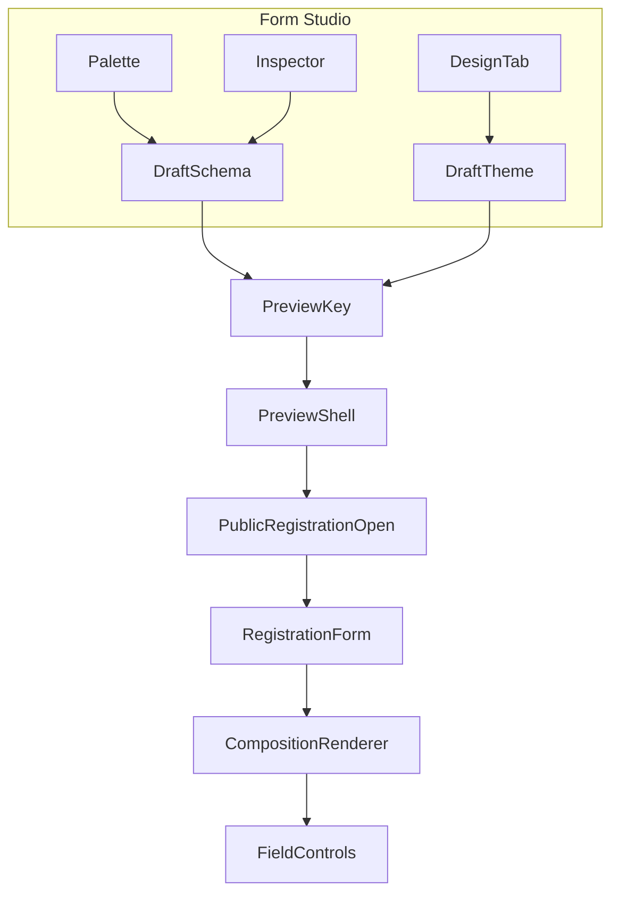

# Architecture spine — Form Studio 2.0

## Paradigm

**Brownfield evolution:** extend `ActivityFormSchema` with a **composition layer**; keep **input fields** as the validation/submission source of truth. One renderer pipeline: composition → layout primitives → existing field controls inside `RegistrationForm`.



## AD-1 — Dual-layer schema (composition + fields)

| | |
|---|---|
| **Binds** | `ActivityFormSchema.fields[]` holds all **input** definitions (unchanged IDs/types). Optional `composition: FormCompositionNode[]` defines **render order** and non-input blocks. |
| **Prevents** | Duplicate field definitions inside blocks; second submission model |
| **Rule** | If `composition` absent or empty after normalize → synthesize linear composition from `fields` order (legacy). |

## AD-2 — Composition node kinds (MVP)

| Kind | Purpose | Submitted |
|------|---------|-----------|
| `fieldRef` | `{ fieldId }` | via field |
| `content` | heading, paragraph, divider, image | no |
| `section` | `{ title?, description?, children[] }` | no |
| `columns` | `{ columns: FormCompositionNode[][] }` (max 2 cols MVP) | no |
| `domain` | `activityDetails`, `communityIdentity`, `capacityStatus` | no |

Nested depth cap: **3** (section → columns → fieldRef).

## AD-3 — IDs and ordering

| | |
|---|---|
| **Binds** | Every composition node has stable `id` (uuid/nanoid). Field IDs remain in `fields[]`. |
| **Prevents** | Orphan fieldRefs after delete — normalize removes refs or blocks save with client issue |
| **Rule** | Reorder mutates `composition` only; field definitions stay in `fields[]`. |

## AD-4 — Validation & visibility

| | |
|---|---|
| **Binds** | Validation runs on `fields[]` only (existing `RegistrationForm` logic). `visibleWhen` stays on field definitions. |
| **Prevents** | Logic embedded in composition tree in MVP |
| **Rule** | Phase 2 logic references field IDs declaratively — same store. |

## AD-5 — Persistence & version

| | |
|---|---|
| **Binds** | Bump `ActivityFormSchema.version` to **2** when composition first saved; API accepts v1 read, returns normalized v2 on write optional |
| **Prevents** | Silent data loss |
| **Rule** | Server `normalizeFormSchema` mirrors web; unknown keys preserved in JSON blob if already stored |

## AD-6 — Renderer placement

| | |
|---|---|
| **Binds** | New `RegistrationCompositionRenderer` (client) invoked from `RegistrationForm` for **default** flow; conversational flow may ignore composition until Phase 2 or linearize |
| **Prevents** | Forking submit handlers per layout |
| **Rule** | Shell headers (Modern Centered panel, Split, Poster) remain in `PublicRegistrationOpen`; **composition renders inside form body** unless domain block explicitly replaces header region (config flag on domain block — default: form body only for MVP) |

## AD-7 — Design tokens

| | |
|---|---|
| **Binds** | Extend `RegistrationTheme` with optional `designTokens` object (typography, field, button, background enums) — resolved alongside `resolvedExperience` |
| **Prevents** | Raw CSS strings in theme JSON |
| **Rule** | Style `modern`/`minimal` maps to token presets + existing center-style helpers |

## AD-8 — Preview synchronization

| | |
|---|---|
| **Binds** | Reuse `buildFormStudioPreviewKey(draftSchema, theme)` — include composition hash |
| **Prevents** | Hidden duplicate preview trees |
| **Rule** | Preview defers expensive remount via key; debounce 150–300ms on draft edits |

## AD-9 — Entitlements

| | |
|---|---|
| **Binds** | Block palette filtered by plan; API rejects disallowed block types in composition on save (Core columns, Core domain blocks, Pro conversational unchanged) |
| **Prevents** | UI-only gates |

## AD-10 — Testing

| | |
|---|---|
| **Binds** | Round-trip normalize tests v1→v2; composition renderer unit tests; extend Epic 35 e2e for builder smoke; no snapshot spam |
| **Prevents** | CSS-only responsive proof for new features |

## Deferred

- Full logic DAG UI (Phase 2)
- 3-column layouts
- Editorial/Bold/Soft styles until implemented
- Separate block schema replacing `fields[]`

## Type sketch (implementation reference)

```typescript
type FormCompositionNode =
  | { id: string; kind: "fieldRef"; fieldId: string }
  | { id: string; kind: "content"; type: "heading" | "paragraph" | "divider" | "image"; props: Record<string, unknown> }
  | { id: string; kind: "section"; title?: string; description?: string; children: FormCompositionNode[] }
  | { id: string; kind: "columns"; columns: FormCompositionNode[][] }
  | { id: string; kind: "domain"; domain: "activityDetails" | "communityIdentity" | "capacityStatus" };

type ActivityFormSchema = {
  version: number;
  meta?: FormSchemaMeta | null;
  fields: FormFieldDefinition[];
  composition?: FormCompositionNode[] | null;
};
```
