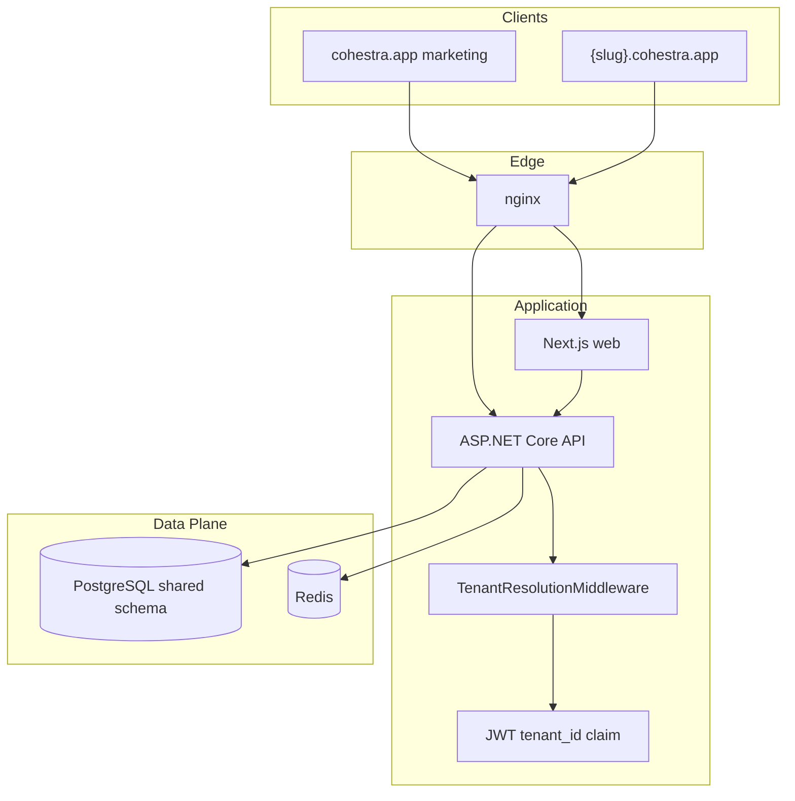

# Architecture Spine — Cohestra Enterprise Multi-Tenant Platform

## Design Paradigm

**Layered clean architecture with a tenant-scoped data plane.** [ADOPTED] Existing Api / Application / Domain / Infrastructure / Contracts structure is unchanged. Tenancy is a **cross-cutting invariant** enforced at HTTP middleware, JWT claims, EF global query filters, and Redis key namespaces — not a separate microservice.



## Inherited Invariants

| Inherited | From parent | Binds here |
| --- | --- | --- |
| API-first, `/api/v1/` versioning | `architecture.md` | All endpoints |
| JWT Bearer admin auth | `architecture.md` | Admin routes + `tenant_id` claim added |
| EF Core + PostgreSQL + Redis | `architecture.md` | Shared DB; tenant filter on entities |
| ProblemDetails errors | `architecture.md` | Unchanged |
| DTOs on wire, never EF entities | `architecture.md` | Unchanged |
| SitePage draft/publish separation | Epic 9 AD-1, AD-2 | Per-tenant SitePage rows |
| Public site Redis cache pattern | Epic 9 AD-4 | Key namespaced by `tenantId` |
| Docker nginx entry point | deploy/nginx | Subdomain routing to same stack |

## Invariants & Rules

### AD-1 — Shared database, row-level tenant isolation

- **Binds:** All business entities, FR-8
- **Prevents:** Schema-per-tenant ops burden; cross-tenant joins by mistake without filter
- **Rule:** Every tenant-owned table has non-nullable `TenantId` (UUID FK → `Tenants`). EF Core global query filter on `ITenantScoped` entities. No admin repository method bypasses filter except Platform Admin audit paths explicitly marked `[RequiresPlatformAdmin]`.

### AD-2 — Tenant resolution from Host header on public routes

- **Binds:** Public site, public registration, FR-11
- **Prevents:** Global slug collisions; wrong homepage on wrong domain
- **Rule:** Parse `{slug}` from `{slug}.cohestra.app` Host. Lookup `Tenants.Slug`. Missing slug → 404. Apex host `cohestra.app` / `www.cohestra.app` is **platform marketing only** — no tenant SitePage.

### AD-3 — JWT carries tenant_id on admin routes

- **Binds:** All `[Authorize]` admin controllers, FR-4
- **Prevents:** Client-supplied `X-Tenant-Id` spoofing
- **Rule:** Access token includes `tenant_id` claim set at login from user's active tenant membership. Middleware validates claim matches resolved tenant on subdomain admin login. Refresh preserves claim.

### AD-4 — One SitePage row per Tenant (supersedes Epic 9 AD-3)

- **Binds:** SitePage entity, FR-12
- **Prevents:** Singleton SitePage leaking across tenants
- **Rule:** `UNIQUE (TenantId)` on `SitePages`. Remove `SitePage.SingletonId` usage. Repository methods always scope by current tenant context. **Conflict surfaced:** Epic 9 AD-3 singleton model is retired for Cohestra Enterprise.

### AD-5 — Composite uniqueness for tenant-scoped slugs

- **Binds:** Activities, FR-14
- **Prevents:** Activity slug collision across tenants
- **Rule:** `UNIQUE (TenantId, Slug)` on Activities. Public URL `/register/{slug}` resolves within resolved tenant only.

### AD-6 — Redis cache keys namespaced by tenant

- **Binds:** Published site cache, dashboard cache, FR-9
- **Prevents:** Cache bleed between tenants
- **Rule:** Pattern `tenant:{tenantId}:public:site:published`, `tenant:{tenantId}:dashboard:metrics`, etc. Invalidate on tenant-scoped publish only.

### AD-7 — TenantMembership join table for RBAC

- **Binds:** Identity, FR-5, FR-6
- **Prevents:** Global single-operator gate; ambiguous user→tenant mapping
- **Rule:** `TenantMemberships(UserId, TenantId, Role)` where Role ∈ `TenantAdmin`, `TenantMember`. Remove `AuthService` single-operator existence check. Platform Admin uses separate `PlatformUsers` or role claim `platform_admin` — not a tenant membership.

### AD-8 — Plan gates enforced server-side

- **Binds:** Website builder, campaigns, seats, FR-12, §13.4 PRD
- **Prevents:** UI-only tier enforcement bypass
- **Rule:** `Tenant.Plan` ∈ `Basic`, `Core`, `Pro`, `Enterprise`. **Basic:** `BillingStatus = Free`, no Stripe. **Core/Pro:** Stripe sync. Campaigns and website builder **Pro+** only. Registration notifications on all tiers. Basic & Core: fixed public site. Enforce limits per §13.4.

### AD-11 — Stripe billing with test/live environment split

- **Binds:** FR-19–FR-23, §13.5 PRD
- **Prevents:** Accidental live charges in dev; plan drift from Stripe state; silent account deletion
- **Rule:** `BillingService` creates Checkout Sessions with `trial_period_days: 30`, **USD only**, monthly or annual Price. Webhook handler idempotent on `event.id`. `Tenant` stores `StripeCustomerId`, `StripeSubscriptionId`, `BillingStatus`, `BillingInterval`, `TrialEndsAt`. **Test keys** in local/CI/staging; **live keys** production only. `BillingStatus` state machine: `Trialing` → `Active` | `PastDue` (week 5, daily notify) → `OnHold` (weeks 6–8, read-only, weekly notify) → `Deleted` (after week 8). Jobs: `TrialReminderJob`, `PastDueNotifier`, `OnHoldNotifier`, `DelinquencyEnforcer`.

### AD-9 — Migration via default tenant backfill

- **Binds:** Brownfield deployment, FR-8
- **Prevents:** Destructive cutover of Platform 0 data
- **Rule:** Migration adds nullable `TenantId`, backfills to seeded `default` tenant, sets NOT NULL, adds filters. Dev/staging Docker continues working with single default tenant until multi-tenant signup ships.

### AD-10 — Cross-tenant isolation integration tests are release gate

- **Binds:** CI, SM-1
- **Prevents:** Shipping tenant leak regressions
- **Rule:** `Api.IntegrationTests` category `TenantIsolation` must pass on every PR to `main`. Minimum cases: tenant A JWT cannot GET tenant B activity; public site for slug A does not return tenant B activities.

## Consistency Conventions

| Concern | Convention |
| --- | --- |
| Entity naming | `Tenant`, `TenantMembership`; FK column `TenantId` (Pascal in C#, snake in DB optional per existing EF config) |
| Slug format | Lowercase `[a-z0-9-]`, 3–48 chars; reserved: `www`, `api`, `admin`, `app`, `platform` |
| JWT claims | `sub`, `tenant_id`, `role`, optional `platform_admin=true` |
| Public API | No auth; tenant from Host only |
| Admin API | JWT required; tenant from claim + Host alignment |
| Logging | Structured field `tenantId` on every business log line |
| Errors | 404 for unknown tenant slug; 403 for plan gate or cross-tenant access |

## Stack

| Name | Version |
| --- | --- |
| .NET | 9.0 |
| ASP.NET Core Web API | 9.0 |
| Entity Framework Core | 9.0 |
| PostgreSQL | 16 |
| Redis | 7 |
| Next.js | 15+ (App Router) |
| Docker Compose | cohestra-infra (local) / cohestra-infra-uat (prod) |

## Structural Seed

```text
src/
  Domain/
    Tenants/Tenant.cs          # + StripeCustomerId, BillingStatus, BillingInterval, TrialEndsAt
    Tenants/TenantMembership.cs
    Tenants/TenantPlan.cs
    Billing/BillingStatus.cs
    Site/SitePage.cs          # + TenantId
    ...                       # all business entities + TenantId
  Infrastructure/
    Tenancy/TenantResolutionMiddleware.cs
    Tenancy/TenantQueryFilterExtensions.cs
    Billing/BillingService.cs
    Billing/StripeWebhookHandler.cs
    Billing/TrialReminderJob.cs
    Billing/PastDueNotifierJob.cs
    Billing/OnHoldNotifierJob.cs
    Billing/DelinquencyEnforcerJob.cs
    Site/SitePageService.cs   # tenant-scoped
  Api/
    Controllers/V1/PlatformTenantsController.cs   # platform admin
    Controllers/V1/BillingController.cs
    Controllers/V1/StripeWebhookController.cs
web/
  middleware.ts               # forward Host to API
  app/page.tsx                # tenant homepage when subdomain
docs/marketing/
  pricing-tiers.md
```

```mermaid
erDiagram
  Tenant ||--o{ TenantMembership : has
  Tenant ||--o| SitePage : owns
  Tenant ||--o{ Activity : owns
  Tenant ||--o{ Client : owns
  Tenant {
    uuid Id PK
    string Slug UK
    string Name
    enum Plan
    enum Status
  }
  SitePage {
    uuid Id PK
    uuid TenantId FK UK
    jsonb DraftSections
    jsonb PublishedSections
  }
  Activity {
    uuid Id PK
    uuid TenantId FK
    string Slug
  }
```

## Capability → Architecture Map

| Capability / FR | Lives in | Governed by |
| --- | --- | --- |
| Tenant provisioning FR-1–3 | `TenantService`, signup API | AD-1, AD-7, AD-9 |
| RBAC FR-4–7 | Identity + `TenantMembership` | AD-3, AD-7 |
| Data isolation FR-8–10 | EF filters + middleware | AD-1, AD-10 |
| Subdomain routing FR-11 | nginx + middleware + Next.js | AD-2 |
| Per-tenant SitePage FR-12–13 | `SitePageService` | AD-4, AD-6, AD-8 |
| Platform 0 features FR-14–16 | Existing services + `TenantId` | AD-1, AD-5 |
| Plan gates §13.4 | `PlanGateFilter` or service checks | AD-8 |
| Stripe billing FR-19–23 | `BillingService`, `StripeWebhookController`, delinquency jobs | AD-11 |
| Trial reminders FR-21 | `TrialReminderJob` (daily) | AD-11 |
| Delinquency lifecycle FR-23 | `PastDueNotifier`, `OnHoldNotifier`, `DelinquencyEnforcer` | AD-11 |

## Deployment & Environments

| Environment | Docker project | Tenant routing |
| --- | --- | --- |
| Local dev | `cohestra-infra` | `{slug}.localhost` or `DEV_TENANT_SLUG` |
| Production | `cohestra-infra-uat` | `{slug}.cohestra.app` |
| Marketing apex | Same stack | `cohestra.app` → marketing routes only |

## Deferred

| Decision | Reason deferred |
| --- | --- |
| Custom domain per tenant (`events.client.com`) | DNS + cert automation; Enterprise v1.1 |
| Schema-per-tenant | AD-1 sufficient for 100-tenant target |
| Tenant switcher (multi-membership UI) | One session = one tenant in v1 |
| Platform Admin impersonation / break-glass | Audit complexity; metadata-only admin in v1 |
| Per-tenant SendGrid API keys | Shared platform key + per-tenant sender auth first |
| Event sourcing / tenant audit export | Append-only logs sufficient for MVP |
