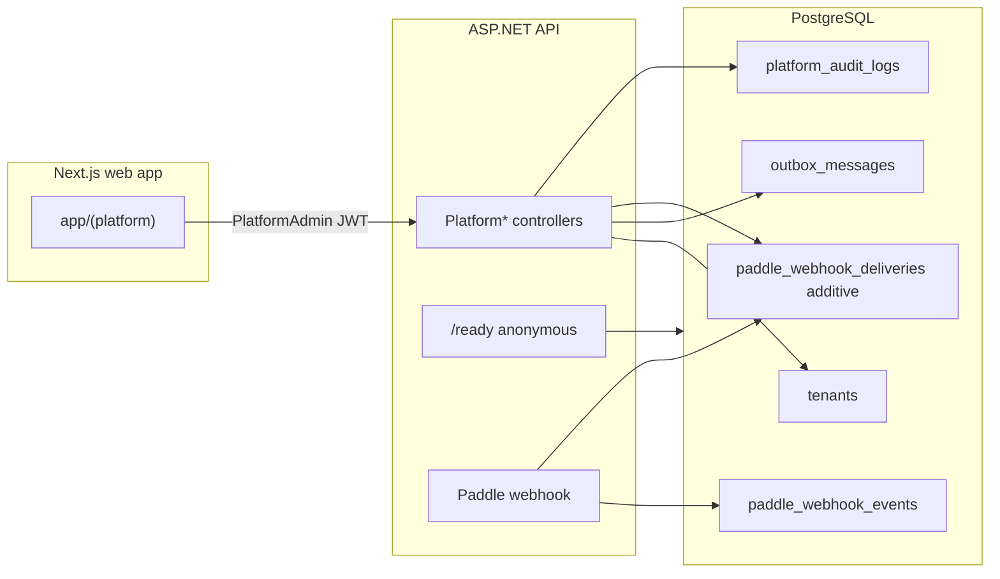
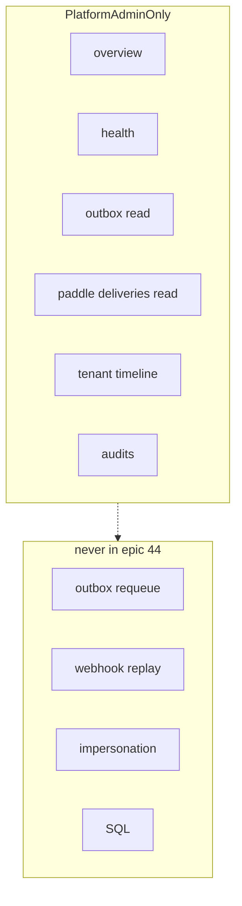

# Architecture Spine — Epic 44 Platform Production Support

## Design Paradigm

Layered modular monolith already in tree: `Api` → `Application` → `Infrastructure` → `Domain` / `Contracts`. Platform support is **read models + additive diagnostic writes** on that plane. No new process, no Hangfire, no second web app.



## Inherited Invariants

| Inherited | From parent | Binds here |
| --- | --- | --- |
| AD-2 Host routing; apex marketing | enterprise spine | `/platform/login` apex only; tenant host 307 |
| AD-3 JWT tenant_id + Host; never trust X-Tenant-Id | enterprise spine | Platform tokens have **no** tenant_id |
| AD-7 Platform Admin is claim `platform_admin`, not TenantMembership | enterprise spine | `PlatformAdminOnly` |
| AD-10 TenantIsolation CI gate | enterprise spine | New tenantId filters |
| Dual dials Suspended wins; OnHold ≠ Suspend | AD-11 / FR-3 | Diagnostics display-only |
| Paddle adapter-only process | Epic 29 | No billing state machine change |
| FR-18 `/ready` unauthenticated | enterprise FR-18 | Do not widen public probe |
| 43.4 staff-console UX | spec-43-4 | Tokens, skip-link, copy lock |

## Invariants & Rules

### AD-12 — Same Platform Admin plane [ADOPTED]

- **Binds:** all 44.x UI/API
- **Prevents:** second frontend; tenant Admin chrome merge
- **Rule:** Routes live under `web/app/(platform)` and `src/Api/Controllers/V1/Platform*.cs`. Authz is `TenantAuthPolicies.PlatformAdminOnly`. Login remains `/platform/login`.

### AD-13 — KPI provenance envelope [ADOPTED]

- **Binds:** FR-44-5, Overview, Health, Outbox, Version
- **Prevents:** two stories inventing incompatible metric JSON; fake live charts
- **Rule:** Every displayed metric is `PlatformKpi<T> { value, source, observedAt, freshness }` where `freshness` ∈ `actual` | `missing_instrumentation` | `unavailable` | `stale`. No client-side synthetic gauges.

### AD-14 — `/ready` contract frozen [ADOPTED]

- **Binds:** FR-44-6, NFR-44-6
- **Prevents:** public probe silently gaining outbox/Paddle/SendGrid
- **Rule:** Anonymous `/ready` stays postgres + redis + default-tenant. Richer checks go to authenticated `GET /api/v1/platform/ops/health`. Copy must not claim unchecked dependencies are healthy.

### AD-15 — Safe diagnostic DTOs [ADOPTED]

- **Binds:** FR-44-9, NFR-44-1, NFR-44-2
- **Prevents:** payload/secret/trace leak via two different serializers
- **Rule:** Never return `OutboxMessage.PayloadJson`, email bodies, access tokens, connection strings, `Paddle__*` secrets, or exception stacks. `lastErrorSanitized` / disposition detail max 200 chars after redaction. List `pageSize` default 25, max 50.

### AD-16 — Paddle disposition is additive [ADOPTED]

- **Binds:** FR-44-10, Story 44.5
- **Prevents:** using `paddle_webhook_events` as a failure log; changing idempotency
- **Rule:** Keep `paddle_webhook_events` insert-after-success unique on `EventId`. New `paddle_webhook_deliveries` (name locked) records processor dispositions **and** controller invalid-signature/malformed/missing-secret outcomes. Do not store raw bodies. Diagnostic insert failure must not change webhook HTTP status. No replay endpoint.

### AD-17 — Recovery limiter fail-closed [ADOPTED]

- **Binds:** FR-44-2, Story 44.1
- **Prevents:** mail flood when Redis is down
- **Rule:** Reuse `RedisRateLimiterOperations`. Outage → `RateLimiterUnavailableException` → 503. Limit applies per PlatformAdmin actor on recovery POSTs.

### AD-18 — No mutation of payment or outbox execution [ADOPTED]

- **Binds:** FR-44-17
- **Prevents:** “helpful” replay/requeue in a later 44.x PR
- **Rule:** Epic 44 ships zero webhook replay, zero outbox requeue, zero BillingStatus writes, zero SQL consoles, zero impersonation.

### AD-19 — Version SHA is staff-only [ADOPTED]

- **Binds:** FR-44-15, Story 44.9
- **Prevents:** putting git SHA on public `/api/v1/system/info`
- **Rule:** SHA lives on `GET /api/v1/platform/ops/version`. Unset → `missing_instrumentation`. Public system info unchanged.



## Consistency Conventions

| Concern | Convention |
| --- | --- |
| Routes | `/api/v1/platform/ops/*` for observability; existing `/api/v1/platform/tenants|support-issues` stay |
| Errors | ProblemDetails + `traceId`; 401/403/404/409/429/503 as existing platform services |
| Auth | Class-level `PlatformAdminOnly`; policy tests enumerate every Platform* controller |
| Time | `DateTimeOffset` UTC |
| Pagination | `page`, `pageSize`, `totalCount` like `TenantListResponse` |
| Logging | No secrets; tenantId when resolved; webhook signature failures already `LogWarning` |
| Config | `PlatformRecoveryRateLimit` section; `GIT_SHA` env |

## Stack

| Name | Version |
| --- | --- |
| .NET / ASP.NET | 9.0 (repo `net9.0`) |
| EF Core / Npgsql | 9.0.x (existing) |
| PostgreSQL | 16 |
| Redis | 7 |
| Next.js | 16.2.x |
| Paddle webhook | existing `PaddleWebhookProcessor` on `69814fc3` |

Reality-checked against `project-context.md`, `Api.csproj` line, and HEAD processor — not a new stack.

## Structural Seed

```text
src/Contracts/Platform/          # KPI envelope + ops DTOs
src/Application/Platform/        # query interfaces
src/Infrastructure/Platform/     # implementations
src/Infrastructure/Billing/      # disposition writer beside processor — no semantic change
src/Domain/Billing/              # PaddleWebhookDelivery entity (44.5 only)
web/app/(platform)/platform/overview/
web/app/(platform)/platform/ops/
web/app/(platform)/platform/audits/
web/lib/platform-api.ts          # extend, do not fork
```

Tables created **when the story needs them**: `paddle_webhook_deliveries` in 44.5; `SupportIssue.Severity` in 44.8. No upfront schema dump in 44.1.

## Capability → Architecture Map

| Capability | Lives in | Governed by |
| --- | --- | --- |
| HTTP gates / recovery limit | 44.1, Auth + RateLimiting | AD-12, AD-17 |
| Overview KPIs | 44.2 | AD-13 |
| Health | 44.3, HealthCheckService | AD-14 |
| Outbox read | 44.4 | AD-15 |
| Paddle diagnostics | 44.5 | AD-16 |
| Timeline | 44.6 | AD-15, tenantId isolation |
| Audits | 44.7 | AD-15, NFR-4 PII |
| Severity | 44.8 | additive column |
| Version | 44.9 | AD-19 |

## Deferred

- Outbox requeue (owner: not authorized)
- Incident aggregate
- OTel/Serilog
- Hosted-job heartbeat table (health lists them as `missing_instrumentation`)
- Auditing every diagnostic GET (default off)
- Widening `/ready`
