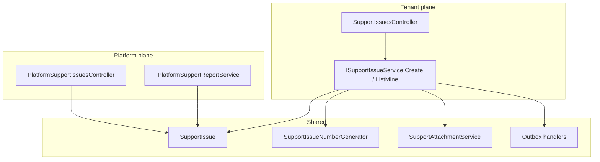

# Architecture Spine — Support Issue Tracker

## Design Paradigm

**Layered clean architecture with two HTTP planes sharing one `SupportIssue` aggregate.** Operator intake is tenant-scoped (`/api/v1/admin/support-issues`). Triage and reporting are platform-scoped (`/api/v1/platform/support-issues`). Same PostgreSQL rows; platform queries use existing `IgnoreTenantFilters` (same pattern as `PlatformTenantService`).

```mermaid
flowchart LR
  Op[Operator Settings] --> AdminAPI["POST /api/v1/admin/support-issues"]
  AdminAPI --> Issue[(SupportIssues)]
  AdminAPI --> Outbox[(Outbox)]
  Outbox --> SG[SendGrid]
  SG --> Tech[techsolutions@creativorare.com]
  SG --> OpMail[operator via noreply@]
  Plat[Platform Support UI] --> PlatAPI["/api/v1/platform/support-issues"]
  PlatAPI --> Issue
```

## Inherited Invariants

| Inherited | From parent | Binds here |
| --- | --- | --- |
| Layered Api/Application/Domain/Infrastructure/Contracts | enterprise spine | All new types |
| TenantOperator vs PlatformAdminOnly | enterprise AD auth | Admin vs platform controllers |
| EF global tenant filter + explicit IgnoreTenantFilters for platform | enterprise AD-1 | SupportIssue is ITenantScoped; platform list bypasses filter |
| Outbox for outbound email | existing OutboxMessage | Both support emails |
| ProblemDetails | architecture.md | API errors |
| DTO on wire, never EF entity | architecture.md | Support contracts |

## Invariants & Rules

### AD-1 — One aggregate, two planes `[ADOPTED]`

- **Binds:** FR-2, FR-11, FR-13
- **Prevents:** Duplicate “email-only” records vs “ticket” records that drift
- **Rule:** Creating a support request always inserts `SupportIssue` (+ attachments) in the same transaction as outbox enqueue. Platform admin never creates a second system of record.

### AD-2 — Globally unique issue numbers `[ADOPTED]`

- **Binds:** FR-5
- **Prevents:** Two tenants sharing `SUP…` values that collide in the platform inbox
- **Rule:** `IssueNumber` unique index is **global** (not `(TenantId, IssueNumber)`). Format `SUP{yyyyMMdd}{6-digit}` UTC, generator modeled on `RegistrationNumberGenerator` but scanning all issues for that day’s prefix.

### AD-3 — Dual outbox messages, independent retry

- **Binds:** FR-8, FR-9, FR-10
- **Prevents:** One failed SendGrid call rolling back the issue; or a single payload that cannot retry one recipient
- **Rule:** Two message types: `support.issue.tech` and `support.issue.confirmation`. Dedupe keys `support:{issueId}:tech` and `support:{issueId}:confirmation`. Issue row is source of truth if either email lags.

### AD-4 — File attachments on EmailMessage, private disk for files

- **Binds:** FR-7, FR-8
- **Prevents:** Public campaign-asset URLs leaking screenshots; inline-only SendGrid missing downloadable files
- **Rule:** Extend `EmailMessage` with `FileAttachments` (`Disposition=attachment`) and `ReplyToEmail`. Store files under a private path (e.g. `data/support-attachments/{issueId}/`). Download only via `PlatformAdminOnly` (and optionally the submitting operator’s own issue). Never register on `PublicCampaignAssetsController`.

### AD-5 — Confirmation From is noreply; tech To is config

- **Binds:** FR-8, FR-9
- **Prevents:** Operators seeing techsolutions@ as From; tech mail missing Reply-To
- **Rule:** Confirmation: From `noreply@creativorare.com` (SendGrid FromEmail). Tech: To `Support:RecipientEmail` default `techsolutions@creativorare.com`, From same verified sender, Reply-To operator email. Subject of both includes `IssueNumber`.

### AD-6 — Platform report is not tenant ReportService

- **Binds:** FR-14
- **Prevents:** Tenant operators seeing other tenants’ support volume; stuffing platform metrics into `/api/v1/admin/reports`
- **Rule:** New platform controller + service. Auth `PlatformAdminOnly`. Aggregates ignore tenant filter.

### AD-7 — Status mutations are platform-only in v1

- **Binds:** FR-6, FR-13
- **Prevents:** Operators closing issues they submitted to hide them from ops
- **Rule:** Operator API is create + list-own. PATCH status (and internal notes) only on platform API.



## Consistency Conventions

| Concern | Convention |
| --- | --- |
| Naming | Domain `SupportIssue`, `SupportIssueAttachment`; APIs `support-issues`; web `help-support-section.tsx`, `/platform/support` |
| IDs | PK `Guid` v7; display `IssueNumber` string; never show raw Guid to operators |
| Errors | ProblemDetails; 429 for rate limit |
| Auth | Admin routes need tenant host + TenantOperator JWT; platform routes skip tenant context |
| Config | `Support:RecipientEmail`, `Support:AttachmentStoragePath`, `Support:MaxFiles`, `Support:MaxFileBytes` |
| Logging | Always include `IssueNumber` |

## Stack

| Name | Version |
| --- | --- |
| ASP.NET Core / EF Core | existing solution |
| Next.js App Router | existing `web/` |
| SendGrid | existing `SendGridEmailSender` |
| PostgreSQL | existing |
| Outbox dispatcher | existing hosted service |

## Structural Seed

```text
src/Domain/Support/
  SupportIssue.cs
  SupportIssueAttachment.cs
  SupportIssueStatus.cs
src/Application/Support/
  ISupportIssueService.cs
src/Infrastructure/Support/
  SupportIssueService.cs
  SupportIssueNumberGenerator.cs
  SupportAttachmentService.cs
  SupportIssueConfirmationEmailBuilder.cs
  SupportIssueTechEmailBuilder.cs
src/Api/Controllers/V1/
  SupportIssuesController.cs
  PlatformSupportIssuesController.cs
  PlatformSupportReportsController.cs
web/components/settings/help-support-section.tsx
web/app/(platform)/platform/support/
```

## Capability → Architecture Map

| Capability | Lives in | Governed by |
| --- | --- | --- |
| Operator submit | SupportIssuesController | AD-1, AD-2, AD-4 |
| Dual email | Outbox handlers + IEmailSender | AD-3, AD-5 |
| Platform list/detail | PlatformSupportIssuesController | AD-1, AD-7 |
| Volume report | PlatformSupportReportsController | AD-6 |
| Docs pointer | product-docs-content.ts | FR-15 (no new AD) |

## Deferred

- In-app reply thread / two-way messaging (would need events + operator notifications).
- Attachment TTL job (NFR-3) until retention is confirmed.
- Public `/contact` for logged-out users.
- Third-party ticketing sync.
- Plan-based SLA fields on the issue row.
