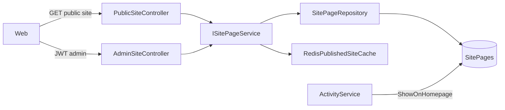
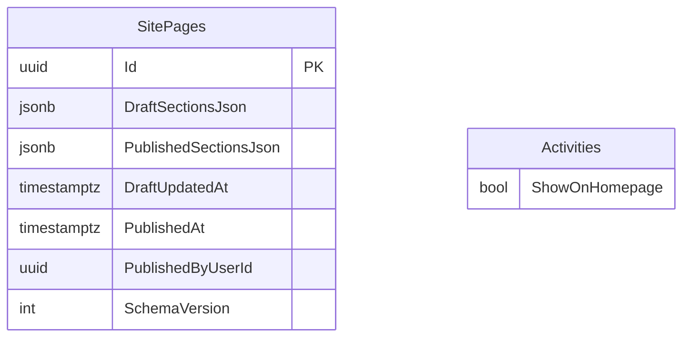

# Architecture Spine — Website Builder (Epic 9)

## Design Paradigm

Layered clean architecture (existing stack). **Site Page** is a new domain aggregate; JSON section document stored in PostgreSQL JSONB; Application service owns draft/publish; Infrastructure owns EF mapping and Redis cache.



## Inherited Invariants

| Inherited | From parent | Binds here |
| --- | --- | --- |
| API-first, JWT admin, anonymous public read | `architecture.md` | All new endpoints under `/api/v1/` |
| EF Core + PostgreSQL + Redis | `architecture.md` | SitePage table + cache |
| ProblemDetails errors | `architecture.md` | Validation failures |
| Campaign asset pipeline for images | Epic 5 / existing | Logo + hero asset IDs |
| UX-DR26 platform typography | UX parent | Section renderers use fixed layout components |

## Invariants & Rules

### AD-1 — Draft and published payloads are separate columns

- **Binds:** SitePage entity, FR-1
- **Prevents:** Anonymous users seeing half-edited homepage
- **Rule:** `DraftSectionsJson` and `PublishedSectionsJson` are separate JSONB columns; public API reads **published only**; admin GET returns draft + publish metadata.

### AD-2 — Publish is an explicit application operation

- **Binds:** `POST /api/v1/admin/site/publish`, FR-7
- **Prevents:** PUT draft accidentally going live
- **Rule:** Only `PublishAsync` copies draft → published, sets `PublishedAt`, invalidates cache. `UpdateDraftAsync` never modifies published column.

### AD-3 — Singleton Site Page per deployment

- **Binds:** SitePage repository, FR-1
- **Prevents:** Multi-row ambiguity for single-tenant deploy
- **Rule:** One row keyed by fixed singleton id or `IsActive` flag; repository exposes `GetAsync()` without tenant id for MVP.

### AD-4 — Public site cache mirrors activity cache pattern

- **Binds:** `RedisPublishedSiteCache`, FR-3
- **Prevents:** Ad-hoc cache keys and stale homepage after publish
- **Rule:** Redis key `public:site:published`; invalidate on publish; TTL 15 minutes; JSON camelCase same as `RedisPublicActivityCache`.

### AD-5 — Section schema version in JSON root

- **Binds:** SitePage JSON document, addendum §2
- **Prevents:** Silent breakage when new section types added
- **Rule:** Root object includes `schemaVersion: 1`; unknown section types skipped at render; validator rejects unsupported version on PUT.

### AD-6 — ShowOnHomepage lives on Activity

- **Binds:** Activity entity, FR-16
- **Prevents:** Duplicating activity selection inside Site Page JSON
- **Rule:** Upcoming activities query: `Status = Published AND ShowOnHomepage = true`, ordered by schedule; not stored as manual slug list in Site Page v1.

### AD-7 — No arbitrary HTML in section JSON

- **Binds:** All section types, PRD NFR
- **Prevents:** XSS via operator-edited homepage
- **Rule:** Section props are structured fields only; render via typed React components; API rejects unknown keys beyond schema.

## Consistency Conventions

| Concern | Convention |
| --- | --- |
| Naming | `SitePage`, `ISitePageService`, `SitePageController`, contracts in `LeadGenerationCrm.Contracts.Site` |
| Routes | Public: `api/v1/public/site`; Admin: `api/v1/admin/site`, `POST .../publish` |
| JSON | camelCase API; JSONB in postgres; asset refs as GUID strings |
| Errors | `InvalidOperationException` → 400 ProblemDetails with message |
| Auth | Admin routes `[Authorize(Roles = OperatorSeeder.AdminRole)]`; public `[AllowAnonymous]` |

## Stack

| Name | Version |
| --- | --- |
| ASP.NET Core | 9.0 |
| EF Core | 9.0 |
| PostgreSQL | 16 (JSONB) |
| Redis | StackExchange.Redis 2.8 |
| Next.js | 15 (web — stories 9.4+) |

## Structural Seed

```text
src/
  Domain/Site/SitePage.cs
  Application/Site/ISitePageService.cs
  Infrastructure/Site/SitePageService.cs
  Infrastructure/Site/SitePublishGateValidator.cs
  Infrastructure/Site/RedisPublishedSiteCache.cs
  Infrastructure/Persistence/Configurations/SitePageConfiguration.cs
  Contracts/Site/SitePageDraftResponse.cs
  Contracts/Site/PublicSiteResponse.cs
  Contracts/Site/UpdateSiteDraftRequest.cs
  Api/Controllers/V1/PublicSiteController.cs
  Api/Controllers/V1/AdminSiteController.cs
```



## Capability → Architecture Map

| Capability | Lives in | Governed by |
| --- | --- | --- |
| Persist draft/published | `SitePageService` + EF | AD-1, AD-2 |
| Public read + cache | `PublicSiteController` + Redis | AD-4 |
| Admin save/publish | `AdminSiteController` | AD-2, AD-5 |
| Publish validation | `SitePublishGateValidator` | FR-8 |
| Seed on deploy | Migration or `SitePageSeeder` | AD-3, FR-17 |
| Homepage activity feed | Query in `SitePageService` or dedicated read | AD-6 |

## Deferred

- **Publish history / revert** — Story 9.8; optional `SitePagePublishHistory` table
- **Preview token crypto** — Story 9.4; short-lived HMAC or JWT claim
- **Web runtime render** — Stories 9.4–9.5; this spine covers 9.1 API foundation
- **Theme presets** — Story 9.8 / event v2
- **Multi-tenant SitePage rows** — future SaaS
