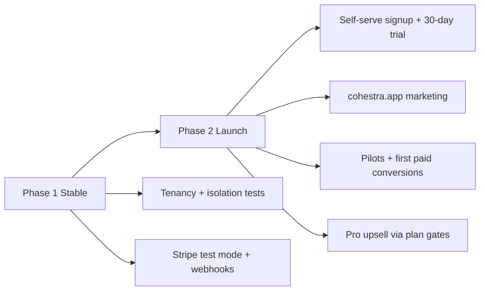

# PRD: Cohestra Enterprise

*Multi-tenant enterprise SaaS — distinct from the single-operator **lead-generation-crm** product.*

## 0. Document Purpose

This PRD defines **Cohestra Enterprise** — a multi-tenant SaaS platform where many **Tenant Organizations** run isolated community-event and lead-capture operations on shared infrastructure.

It is written for product stakeholders, architects, UX, and implementation agents building in the **Cohestra** repository via Cursor Cloud and local development.

**Structure:** Glossary-anchored vocabulary, globally numbered **Functional Requirements (FRs)**, **User Journeys (UJ-N)**, and **Success Metrics (SM-N)**. Assumptions are tagged `[ASSUMPTION]` and indexed in §9. Mechanism and transport choices live in `addendum.md`.

**Inputs:**
- Sprint Change Proposal `sprint-change-proposal-2026-07-14.md` (enterprise pivot)
- Inherited single-operator PRD `prd-lead-generation-crm-2026-06-14/prd.md` (Platform 0 domain features)
- Brownfield codebase: Epics 1–10 complete (activities, clients, campaigns, reports, website builder)

**Product boundary:** This PRD does **not** govern **lead-generation-crm** — a separate single-operator product that continues in its own repository.

---

## 1. Vision

Community and activity-driven organizations capture leads through events, QR registrations, and referral-driven sign-ups — but when each organization runs isolated spreadsheets, forms, and messaging tools, growth data fragments and operational cost scales linearly with headcount.

**Cohestra Enterprise** is a multi-tenant platform: each **Tenant Organization** gets a fully isolated workspace with branded public surfaces, operator accounts, activities, client lists, campaigns, and reports — without sharing data with other tenants. The platform operator (Creativorare / Cohestra team) provisions and governs tenants while tenant admins run day-to-day community operations.

The inherited **Platform 0** codebase already implements the activity-engine CRM for one operator. Enterprise v1 adds the **tenancy spine** so that capability serves many organizations safely on one deployment.

**Platform promise (enterprise):** Every tenant's activities become measurable lead-generation engines with **no cross-tenant data leakage** and **no lost context** after registration.

### Why Now

- Platform 0 proves domain value (activities, dedup, campaigns, site builder) on working brownfield code.
- Market positioning shifts from one-off client builds to **repeatable enterprise SaaS**.
- Multi-tenant isolation is a prerequisite for production SaaS revenue and operational scale.

---

## 2. Target User

### 2.1 Jobs To Be Done

**Tenant admin (organization operator)**
- Stand up a branded community-events workspace without engineering help.
- Invite colleagues to operate activities and follow up on leads under RBAC.
- Run activities, registrations, campaigns, and reports with confidence that data stays inside the organization.
- Configure public homepage and registration flows per tenant brand.

**Tenant member (operator)**
- Perform day-to-day activity and client operations within permissions granted by tenant admin.
- See only data belonging to their **Tenant Organization**.

**Platform admin (Cohestra operator)**
- Provision, suspend, and monitor **Tenant Organizations** on shared infrastructure.
- Investigate support issues without routine access to tenant business data `[ASSUMPTION: break-glass audit only, not default]`.

**Activity participant (public registrant)**
- Register for tenant activities via mobile-friendly public pages scoped to the correct organization.
- Receive confirmation with registration number; no account required.

### 2.2 Non-Users & billing boundaries (enterprise v1)

- **lead-generation-crm operators** — use the separate single-operator product; not Cohestra Enterprise tenants.
- **Self-serve marketplace buyers comparing CRM categories** — enterprise v1 targets activity-led community operators, not horizontal sales CRM.
- **Participant self-service portals** — participants do not log in; public registration only.
- **Tenant Members managing billing** — only **Tenant Admin** manages subscription (Stripe Customer Portal); Members cannot open billing settings (UJ-2).
- **Custom finance back-office** — in-app invoices, credit notes, tax-ID admin UI, accounting sync — **not in v1**. Paid tiers use Stripe Checkout + **Customer Portal** (FR-19–24). Stripe Tax deferred until setup verified (P11 / FR-26a).

### 2.3 Key User Journeys

- **UJ-1. Priya starts free on Basic (primary signup).**
  - **Persona + context:** Priya, operations lead at Ikigai Sports, trying Cohestra without a card (P6 **Start free**).
  - **Entry state:** Unauthenticated; marketing site → **Start free** signup (CAPTCHA + ToS/Privacy acceptance — FR-26 / FR-26a).
  - **Path:** Organization name, **Tenant Slug**, admin email, password → email OTP verify → lands in empty **Basic** tenant dashboard (Plan=Basic, BillingStatus=Free, no Stripe, no SitePage) → creates first **Community** (within 1-community cap) and first **Activity** → publishes (within 3 published cap) → copies QR / register link.
  - **Climax:** Public stub at `https://ikigai.cohestra.app/` shows org display name + published activities; `/register/{activity-slug}` accepts participants; Priya is sole **Tenant Admin** (1 seat).
  - **Resolution:** Workspace ready for real ops on Basic footprint (activities, clients, registration emails, fixed report + CSV). Site Page builder / fixed SitePage and Team invites are Core+ upgrade CTAs (FR-12, FR-6).
  - **Edge cases:** Slug collision — system suggests alternatives before commit. Direct Core/Pro trial is a secondary path (FR-19), not this journey.

- **UJ-2. Priya invites Marco as a second operator (Core+).**
  - **Persona + context:** Priya (on **Core** or higher — Basic is **1 seat** and cannot invite) needs help running weekend clinics.
  - **Entry state:** Authenticated **Tenant Admin** on a plan with unused seat capacity.
  - **Path:** Settings → Team → invite email → Marco receives invite → sets password → logs in with **Tenant Member** role.
  - **Climax:** Marco sees dashboard and clients for Ikigai only; cannot access tenant settings or billing.
  - **Resolution:** Multi-user operations without sharing passwords.
  - **Edge cases:** Invite expires after 7 days; Priya can resend. On **Basic**, Team invite is disabled with upgrade CTA to Core (H3). At Core/Pro seat cap, invite disabled until a seat frees or plan upgrades.

- **UJ-3. Elena registers at Ikigai's Sunday clinic (unchanged participant flow, tenant-scoped).**
  - **Persona + context:** Elena scans QR at venue.
  - **Entry state:** Mobile browser on `https://ikigai.cohestra.app/register/sunday-clinic`.
  - **Path:** Completes form → sees registration number → Client dedup runs within **Ikigai tenant only**.
  - **Climax:** Registration stored under Ikigai; no visibility to other tenants' clients.
  - **Resolution:** Priya sees Elena on Ikigai dashboard.
  - **Edge case:** Same phone registered at a *different tenant* creates a separate **Client** — cross-tenant dedup is intentionally not performed.

- **UJ-4. Platform admin suspends a tenant for non-payment.**
  - **Persona + context:** Cohestra platform operator handling billing exception.
  - **Entry state:** Platform admin console.
  - **Path:** Locates tenant → sets status **Suspended** → public pages show maintenance message; tenant admins cannot log in.
  - **Climax:** Other tenants unaffected; audit log records suspension actor and reason.
  - **Resolution:** Reactivation restores access without data loss.

---

## 3. Glossary

- **Platform** — The shared Cohestra Enterprise deployment (API, web, database, cache, email infrastructure) hosting all tenants.

- **Platform Admin** — Cohestra operator with cross-tenant administration rights (provision, suspend, support). Distinct from **Tenant Admin**.

- **Tenant** — An isolated organization workspace on the Platform. Owns all business data (activities, clients, registrations, campaigns, site configuration). Identified by immutable `TenantId` and a unique **Tenant Slug** used in routing.

- **Tenant Organization** — The business entity represented by a **Tenant** (e.g., Ikigai Sports, TGH Tennis Club). Synonym: **Organization** in UI copy maps to **Tenant**.

- **Tenant Admin** — Authenticated user with full administrative rights within one **Tenant** (settings, team, billing, plan upgrades, SendGrid sender, plus all operational modules the plan allows). See FR-5.

- **Tenant Member** — Authenticated user with operational rights within one **Tenant** for modules the **plan allows** (activities, clients, reports; campaigns if Pro; SitePage/builder if Core/Pro). No team, billing, or tenant settings. See FR-5.

- **Tenant Slug** — URL-safe unique identifier for a **Tenant** (e.g., `ikigai-sports`). Used for subdomain routing `[ASSUMPTION: {slug}.cohestra.app]`.

- **Tenant Context** — Runtime resolution of which **Tenant** a request operates on, derived from host header (subdomain) and/or authenticated JWT `tenant_id` claim.

- **Platform 0** — Inherited single-operator feature set (Epics 1–10) implemented in the brownfield codebase before enterprise tenancy. Becomes **tenant-scoped modules** under this PRD.

- **Activity**, **Client**, **Registration**, **Campaign**, **Report**, **Community**, **Category**, **Form**, **QR Code**, **Lead Status**, **Registration number**, **Site Page** — Domain terms as defined in Platform 0 PRD, with the constraint that all instances are scoped to exactly one **Tenant**.

- **Community** — An operator-defined program or brand **within one Tenant** (e.g., "Running Club", "Youth Program", "Pickleball"). Managed in **Activities → Communities**; activities store a `CommunityLabel`; used for filters, reports, and campaigns. **Not** a separate tenant, subdomain, login, or billing account. **Terminology policy (Option A):** **Community** is the official product term in UI, PRD, pricing limits, and support. Marketing may say "club" or "program" in prose; those words always refer to a **Community** in the app.

- **Data isolation** — Guarantee that no API query, cache key, or export returns another **Tenant**'s records.

---

## 4. Features

### 4.1 Tenant Provisioning & Lifecycle

**Description:** The Platform supports creating and managing **Tenant** workspaces. Realizes UJ-1, UJ-4.

#### FR-1: Self-serve tenant signup

A prospective **Tenant Admin** can register a new **Tenant Organization** with organization name, **Tenant Slug**, admin email, and password. Realizes UJ-1.

**Consequences (testable):**
- Successful signup creates **Tenant** row, first **Tenant Admin** user, and plan per path (Basic free, or Core/Pro via Checkout — FR-19). SitePage seeded only for Core+ (FR-12).
- **Tenant Slug** is globally unique; collision returns validation error with suggestions.
- Slug rules **(P10 Option A):** lowercase `[a-z0-9-]`; length **3–48**; must start and end with alphanumeric; no unicode. Reserved: `www`, `api`, `admin`, `app`, `platform`, `mail`, `ftp`, `cdn`, `static`, `status`, `support`, `help`, `billing`, `cohestra`.
- Email verification required before admin dashboard access.
- Signup is disabled when Platform sets `registrationClosed=true` `[ASSUMPTION: sales-led tenants created by Platform Admin when self-serve disabled]`.
- Abuse controls per FR-26 apply to all self-serve signups.

#### FR-2: Platform-admin tenant provisioning

A **Platform Admin** can create, suspend, reactivate, and archive **Tenants** without using self-serve signup. Realizes UJ-4.

**Complimentary plans (P12 Option A):** Platform Admin may set `IsComplimentary=true` and assign `Plan` ∈ Basic/Core/Pro without Stripe. `BillingStatus=Free`. No FR-23 delinquency. FR-25 Basic dormancy applies only when Plan=Basic; complimentary Core/Pro are exempt. Converting to paid: clear complimentary flag → tenant completes Checkout (FR-19).

**Consequences (testable):**
- Suspended tenant blocks tenant admin login and returns maintenance state on public routes.
- Archived tenant is read-only for 30 days then hard-deleted per retention policy `[ASSUMPTION: 30-day soft archive]`.
- All lifecycle changes append to platform audit log with actor, timestamp, reason.
- Only Platform Admin can set/clear `IsComplimentary`; self-serve cannot grant Core/Pro without Stripe (unless Checkout).
- Complimentary Pro tenant has Pro limits and no `StripeSubscriptionId`.

#### FR-3: Tenant status machine (operational)

Each **Tenant** has operational status: `Active`, `Suspended`, `Archived`.

**Separate from billing:** Money lifecycle uses `BillingStatus` (FR-19, FR-23). **P1 ratified — Option A:** keep both fields; access is the intersection of both dials.

**Consequences (testable):**
- Only `Active` + non-blocking billing allows full admin writes and public registrations (see matrix below).
- `Suspended` **always wins** over billing: blocks tenant admin login and shows maintenance on public routes, regardless of `BillingStatus`.
- `Suspended` allows Platform Admin metadata inspection (no break-glass impersonation in MVP).
- Status transitions are idempotent and audited.
- Billing `OnHold` does **not** change `Tenant.Status` (stays `Active`); only access mode changes.
- End of FR-23 unpaid path: `Tenant.Status → Archived` and billing terminal state (`Deleted` / `Canceled`).

**Access matrix (P1):**

| Tenant.Status | BillingStatus | Admin | Public registration |
|---------------|---------------|-------|---------------------|
| `Active` | `Free` / `Trialing` / `Active` / `PastDue` | Full (plan limits; PastDue = settle banner) | Yes (within limits) |
| `Active` | `OnHold` | Read-only | No |
| `Suspended` | any | Blocked | Maintenance |
| `Archived` | any | Blocked | 404 |

---

### 4.2 Identity, Access & RBAC

**Description:** Multi-user access per **Tenant** with role-based permissions. Replaces Platform 0 single-operator enforcement. Realizes UJ-2.

#### FR-4: Tenant-scoped authentication

An authenticated user session is bound to exactly one **Tenant** via JWT `tenant_id` claim (admin routes) or **Tenant Context** resolution (public routes).

**Consequences (testable):**
- Login fails with clear error if user has no membership in resolved tenant.
- Token refresh preserves `tenant_id`.
- User may belong to multiple tenants `[ASSUMPTION: v1 UI shows one tenant per session; tenant switcher deferred to v1.1]`.

#### FR-5: Tenant roles

**Tenant Admin** and **Tenant Member** roles govern access within a tenant. Effective access = **role ∩ plan gates** (H5 Option A). BillingStatus / Suspended gates still apply (FR-3).

**Admin-only (all plans where the capability exists):**
- Team invite/remove (seat-gated — FR-6); tenant settings; SendGrid sender config
- Billing / Stripe Customer Portal; plan upgrade / Checkout CTAs
- Destructive tenant actions (archive resources to clear over-limit, etc.)

**Member (Core+ seats):** ops modules the **plan allows** — activities, clients, registration reports/CSV; **campaigns** if Pro; **fixed SitePage settings** if Core; **Site Page builder** if Pro. Member does **not** get billing controls. On plan-locked features, Member sees a feature-locked message (not billing CTA); Admin sees upgrade CTA.

| Capability | Tenant Admin | Tenant Member |
|------------|:------------:|:-------------:|
| Activities / clients / dashboard | ✓ (plan limits) | ✓ (plan limits) |
| Reports per plan (FR-15) | ✓ | ✓ |
| Email campaigns | Pro only | Pro only |
| Public site admin (FR-12) | Core+ (fixed / builder) | Core+ (same as plan) |
| Team management | ✓ (seat gate) | — |
| Tenant settings / SendGrid sender | ✓ | — |
| Billing / Customer Portal / upgrade Checkout | ✓ | — |
| Plan-locked feature UI | Upgrade CTA | Feature-locked (no billing) |

**Consequences (testable):**
- Role checks enforced server-side on every admin endpoint (not UI-only).
- Member API calls to billing, team, or tenant settings return 403.
- Member on Core cannot access campaign APIs; Member on Pro can.
- Basic has no Member seats (H3); matrix applies when seats exist (Core/Pro).

#### FR-6: Team invitation

A **Tenant Admin** can invite users by email to join the **Tenant** with a specified role when the tenant has unused **operator seat** capacity. Realizes UJ-2 (**Core+**).

**Seat gate (H3 Option A):** Soft-block at invite UI and API — do not send invites that would exceed plan seats. **Basic = 1 seat** (the Tenant Admin only): Team invite control disabled; clear **upgrade to Core** CTA. Core = 3 seats; Pro = 10. No per-seat add-ons in v1 (P5).

**Consequences (testable):**
- Basic Tenant Admin cannot create invites; API returns plan-limit / upgrade error.
- Invite allowed only when `active_members + pending_invites < plan_seat_cap`.
- Invite token expires in 7 days.
- Accepting invite creates tenant membership; no duplicate global operator block.
- Revoked invite cannot be reused.

#### FR-7: Platform admin role

A **Platform Admin** role exists distinct from tenant roles, gated to platform routes only.

**Consequences (testable):**
- Platform routes reject tenant JWTs without platform claim.
- Platform Admin cannot impersonate tenant admin without audited break-glass `[ASSUMPTION: break-glass deferred — platform admin manages metadata only in MVP]`.

---

### 4.3 Tenant Data Isolation

**Description:** Hard guarantee that tenants cannot read or mutate each other's data. Foundational enterprise requirement.

#### FR-8: Tenant-scoped data model

Every Platform 0 business entity (Activity, Client, Registration, Campaign, Community, Category, SitePage, EmailTemplate, etc.) stores non-nullable `TenantId`.

**Consequences (testable):**
- Database migration adds `TenantId` with backfill to a `default` tenant for dev/staging rows.
- Composite unique constraints include `TenantId` where slugs or codes are unique (e.g., Activity slug).
- EF Core global query filter applies `TenantId` on all tenant-scoped entities.

#### FR-9: Tenant context middleware

Every API request resolves **Tenant Context** before business logic executes.

**Consequences (testable):**
- Missing or unknown tenant returns 404 on public routes, 403 on admin routes.
- Integration test suite includes cross-tenant negative cases (tenant A token cannot read tenant B activity by ID).
- Redis cache keys are namespaced by `TenantId`.

#### FR-10: Export and report isolation

CSV exports and reports include only records for the authenticated **Tenant**.

**Consequences (testable):**
- Export of 10,000 rows from tenant A contains zero tenant B IDs.
- Report aggregation queries always filter by `TenantId`.

---

### 4.4 Tenant Routing & Public Surfaces

**Description:** Each **Tenant** has plan-gated public entry points (stub / fixed SitePage / builder). Replaces deployment-wide singleton SitePage. Realizes UJ-1, UJ-3.

#### FR-11: Subdomain tenant routing

Public and admin web surfaces resolve **Tenant** from subdomain `{tenant-slug}.cohestra.app`. `[ASSUMPTION: apex domain hosts marketing + signup only]`

**Consequences (testable):**
- `https://ikigai.cohestra.app/` renders Ikigai public home per plan (Basic **stub**, Core fixed SitePage, Pro builder — FR-12).
- `https://ikigai.cohestra.app/register/{activity-slug}` scopes activity lookup to Ikigai on all plans.
- Local dev supports `{slug}.localhost` or `?tenant=` override documented in addendum.

#### FR-12: Public site by plan (P2 Option D)

Public homepage capability depends on `Tenant.Plan`:

| Plan | Public `/` | SitePage entity |
|------|------------|-----------------|
| **Basic** | **No Site Page** — minimal **stub** (org display name + list of published activities linking to register) | Not created |
| **Core** | **Fixed Site Page** — branded home (name, accent, upcoming activities); **no** section composer | Created on upgrade to Core (or Core signup); not editable via builder |
| **Pro** | **Full Site Page builder** — draft/publish, wide components (Platform 0 Website Builder, tenant-scoped) | Unlocked composer on existing SitePage |

**Consequences (testable):**
- Basic tenant: no `SitePage` row; `/` renders stub; `/register/{slug}` works; admin Website builder routes return upgrade CTA.
- Basic → Core: creates seeded fixed SitePage; `/` uses fixed template.
- Core → Pro: same SitePage; composer unlocked; publish is tenant-scoped (Ikigai publish does not affect TGH).
- Preview token (Pro) scoped to tenant site draft.

#### FR-13: Per-tenant email branding

SendGrid sender identity and email footer branding are configurable per **Tenant** within platform guardrails.

**Consequences (testable):**
- Campaign sent from Ikigai uses Ikigai's configured From name/email.
- Platform blocks send if tenant sender not verified (inherited delivery checklist, tenant-scoped).

---

### 4.5 Inherited Platform 0 Capabilities (Tenant-Scoped)

**Description:** The following Platform 0 feature areas remain in enterprise v1, executed **within Tenant Context**. Detailed FRs (activity engine, master client list, dashboard, reports, campaigns, WhatsApp click-to-message, website builder sections) are defined in `prd-lead-generation-crm-2026-06-14/prd.md` (FR-1 through FR-20+). This PRD adds tenancy preconditions only.

**Functional Requirements:**

#### FR-14: Tenant-scoped activity engine

All Activity Engine capabilities (create activity, form schema, QR, public registration, registration numbers, dedup) operate within the resolved **Tenant**. Realizes UJ-3.

**Consequences (testable):**
- Activity slug unique per tenant, not globally.
- Registration dedup matches clients within tenant only.
- All Platform 0 registration ingestion tests pass with `TenantId` injected.

#### FR-15: Tenant-scoped dashboard and plan-gated reports

Dashboard metrics and reports reflect only the current **Tenant** data. **Report depth is plan-gated:**

| Plan | Reports |
|------|---------|
| **Basic** | **Fixed simple report** — who registered, registration count, date/time (and registration number); **CSV export** of that list. No filter builder, rankings, or campaign stats. |
| **Core** | **Queryable ops reports** — Platform 0 filters (date range, community, activity, lead status, referral) + aggregates/rankings + full CSV export of filtered results. |
| **Pro** | Everything in Core **+ campaign analytics** + **saved report views** `[ASSUMPTION: saved views in v1]`. |

**Consequences (testable):**
- Dashboard totals for tenant A unchanged when tenant B receives registrations.
- Basic admin cannot open Core filter UI; API rejects advanced report query params with upgrade hint.
- Core CSV respects filters; Basic CSV matches fixed columns only.
- Cache TTL / polling preserved per tenant namespace.

#### FR-16: Tenant-scoped campaigns and templates

Email templates, segments, and campaign sends are tenant-private.

**Consequences (testable):**
- Segment preview counts only tenant clients.
- Campaign history on client profile shows only tenant campaigns.

---

### 4.6 Platform Administration

**Description:** Minimal console for **Platform Admin** to operate the SaaS. Realizes UJ-4.

#### FR-17: Tenant directory

A **Platform Admin** can list tenants with status, slug, created date, admin contact, and aggregate counts (activities, clients — not PII export by default).

**Consequences (testable):**
- Search by slug and organization name.
- Pagination on tenant list.

#### FR-18: Platform health and audit

Platform exposes health endpoints and immutable audit log for tenant lifecycle and platform admin actions.

**Consequences (testable):**
- `/ready` remains unauthenticated; tenant-aware readiness checks default tenant connectivity.
- Audit entries include actor, action, tenantId, timestamp.

---

### 4.7 Billing & Subscriptions

**Description:** Self-serve subscription lifecycle via Stripe. Realizes monetization in §13.

#### FR-19: Free Basic signup and paid Core/Pro subscriptions

**Basic (free):** A prospective **Tenant Admin** can self-serve signup on **Basic** with **no payment method** and **no Stripe subscription**. `Tenant.Plan = Basic`, `BillingStatus = Free`.

**Core / Pro (paid) — P6 Option A:** Two entry paths are supported:
1. **Direct signup** — choose Core or Pro on marketing/pricing → Stripe Checkout + 30-day trial + card.
2. **Upgrade from Basic** — in-app upgrade → same Checkout + trial (or immediate paid if already trialed — product rule: one trial per tenant `[ASSUMPTION]`).

**Primary CTA:** Start free (Basic). **Secondary CTA:** Start Core/Pro trial.

**Consequences (testable):**
- Basic signup: email verification only; no Stripe Customer until first paid path.
- Direct Core/Pro signup creates tenant + Stripe subscription in one flow; disclaimer shown.
- Paid signup disclaimer: *"You will not be charged while your trial is active. Billing starts on {trial_end_date} unless you cancel."*
- `Tenant.BillingStatus` ∈ `Free` (Basic), `Trialing`, `Active`, `PastDue`, `OnHold`, `Canceled`.
- Paid tiers: `StripeCustomerId` and `StripeSubscriptionId` stored; plan synced from Stripe webhooks.
- Stripe **test mode** in local/CI; live mode production only.
- Upgrade from Basic lifts limits when Checkout completes / subscription becomes `Trialing` or `Active`.

#### FR-20: USD-only billing

All subscription prices, Checkout, invoices, and billing UI are denominated in **USD**, regardless of tenant admin location.

**Consequences (testable):**
- Stripe Prices use `currency: usd` only for **Core and Pro** (monthly and annual).
- Marketing and signup display USD; no geo-based currency conversion in v1.
- `Tenant.BillingCurrency` fixed to `USD` (or omitted; USD implied).

#### FR-21: Trial expiration reminders

During the **last 7 days** of trial (`trial_end` − 7 days through `trial_end`), the system sends **one email per day** and shows an **in-app notification** to all Tenant Admins stating that the trial expires soon and the exact expiration date/time.

**Consequences (testable):**
- Day 7, 6, 5, 4, 3, 2, 1 before `trial_end`: email + in-app banner for tenant admins.
- Notification copy includes `{trial_end_date}` and link to billing portal (Stripe Customer Portal).
- After trial end without cancel: Stripe attempts first charge; success → `Active`.

#### FR-22: Monthly and annual billing

Tenants choose **monthly** or **annual** billing at signup or via Customer Portal. Annual plans receive a **discount** vs 12× monthly `[ASSUMPTION: 2 months free — pay 10 months, get 12; confirm in pricing study §13.10]`.

**Consequences (testable):**
- Stripe Prices exist for **Core/Pro** × monthly/annual only. **Basic has no Stripe Price.**
- Checkout and Portal expose both intervals; webhook syncs `BillingInterval` on `Tenant`.
- Annual renewal date = subscription `current_period_end`.

#### FR-23: Delinquency lifecycle (P3 Option A)

**Trigger:** Any failed subscription charge — **trial end** or **renewal** — via Stripe `invoice.payment_failed`. The delinquency clock starts at that failure (`DelinquencyStartedAt`), **not** at trial start.

| Phase | Duration from failure | `BillingStatus` | Operator experience | Notifications |
|-------|----------------------|-----------------|---------------------|---------------|
| **Collect** | Days **1–7** | `PastDue` | Full access (plan limits) | **Daily** email + in-app: settle bill |
| **Hold** | Days **8–28** | `OnHold` | **Read-only** admin; public registration blocked | **Weekly** email + in-app |
| **Terminal** | After day **28** unpaid | Terminal billing + `Tenant.Status → Archived` | Account removed from service | Final notice; purge per §9 |

**Trial reminders (FR-21)** remain separate: daily notices in the **last 7 days before `trial_end`**, while still `Trialing`. After failed first charge, FR-23 Collect begins.

**Consequences (testable):**
- Day 8 after `payment_failed`: `PastDue` → `OnHold`; hold banner + Customer Portal link.
- Successful payment during `PastDue` or `OnHold` → `Active`; `Tenant.Status` stays `Active`; full access restored.
- Day 29 unpaid: archive tenant; subdomain 404; purge per retention.
- Renewal failure and trial-end failure use the **same** job + state machine.
- All state transitions audited.

#### FR-24: Cancel and downgrade at period end (P4 Option A)

**Cancel** (Core/Pro → leave paid) and **downgrade** (Pro → Core, or Core/Pro → Basic) take effect at Stripe **`current_period_end`**, not immediately. Until then, the tenant keeps current plan limits and full access (unless FR-23 delinquency applies).

| Event at period end | Result |
|---------------------|--------|
| Cancel paid | `Plan=Basic`, `BillingStatus=Free`; Stripe subscription ended |
| Downgrade Pro → Core | `Plan=Core`; Core limits apply |
| Downgrade → Basic | `Plan=Basic`, `BillingStatus=Free` |

**Over-limit after change:** If usage exceeds the new plan caps (communities, published activities, seats, etc.), access becomes **`ReadOnly_OverLimit`**: admin read-only, public registration blocked, banner lists what to archive. Full access returns when usage ≤ new plan limits. Does **not** set `Tenant.Status=Suspended`.

**Consequences (testable):**
- Cancel mid-cycle: plan unchanged until `current_period_end`; then Basic + Free.
- Downgrade scheduled: webhook/`customer.subscription.updated` applies new Price/plan at period end.
- Tenant with 8 communities canceling to Basic → read-only until ≤1 community (and other Basic caps).
- Over-limit lock distinct from billing `OnHold` (different banner copy; same read-only public-block behavior).

#### FR-25: Basic dormancy archive (P7 Option A)

Free **Basic** tenants (`Plan=Basic`, `BillingStatus=Free`) that are **inactive for 90 days** are archived.

**Inactive means:** no **Tenant Admin/Member login** and **zero new public registrations** in the rolling 90-day window. Any login or registration **resets** the timer.

| Day in idle window | Action |
|--------------------|--------|
| **83** | Email + in-app warning to Tenant Admins: archive in 7 days unless they sign in |
| **90** | `Tenant.Status → Archived`; public 404; soft-delete then purge per §9 |

Does **not** apply to Core/Pro (paid/trialing/past-due use FR-23). Platform Admin may restore within soft-delete window.

**Consequences (testable):**
- Job selects only Basic+Free with `LastActivityAt` (max of last login, last registration) older than 90 days.
- Warning sent once at day 83; archive at day 90 if still idle.
- Login on day 85 clears pending archive.

#### FR-26a: Legal acceptance at signup (P11 Option A)

Self-serve signup (Basic and direct Core/Pro) requires the user to accept **Terms of Service** and **Privacy Policy** before account creation.

**Consequences (testable):**
- Signup blocked without checked acceptance.
- Platform stores `AcceptedAt`, `TermsVersion`, `PrivacyVersion` on the Tenant Admin (or Tenant) record.
- Marketing site serves `/terms` and `/privacy` before public signup is enabled (launch gate).
- **Stripe Tax:** disabled at v1 launch; enable when seller tax setup is ready and verified (no eng blocker for tenancy). Checkout copy may state prices exclusive of applicable tax.

#### FR-26: Self-serve abuse controls (P8 Option A + CAPTCHA A1)

All **self-serve** tenant signups (Basic and direct Core/Pro) require:

| Control | Rule |
|---------|------|
| **CAPTCHA** | **Always** on signup form (e.g. Cloudflare Turnstile / hCaptcha) — A1 |
| **Email verification** | Before dashboard access (FR-1) |
| **Signup rate limit** | Max **5** successful signups per IP per hour; **20** per IP per day `[ASSUMPTION: tunable]` |
| **Public registration rate limit** | Per-tenant burst limit on `/register` (e.g. 60/min) → HTTP 429 `[ASSUMPTION: tunable]` |

Platform Admin **Suspend** (FR-3) remains the manual break-glass for confirmed abuse.

**Consequences (testable):**
- Signup without valid CAPTCHA token rejected.
- 6th signup from same IP within an hour returns rate-limit error.
- Flood of public registrations to one tenant returns 429 without creating rows beyond burst.

---

## 5. Non-Goals (Explicit)

- **Modifying lead-generation-crm** — separate product; no shared deployment requirement.
- **Cross-tenant client deduplication** — same person at two tenants is two **Clients** by design.
- **Participant login / member portals** — public registration only.
- **WhatsApp Business API** — deferred; click-to-message retained from Platform 0.
- **Automated email drip sequences** — deferred to enterprise v2.
- **Arbitrary custom report builder** (drag-and-drop widgets / ad-hoc SQL) — deferred; Core/Pro use defined query dimensions + filters (FR-15).
- **Enterprise custom contracts in-app** — sales-led deals use manual invoice; self-serve **Basic is free**; **Core / Pro** via Stripe.
- **Tenant custom domains** (`events.ikigai.com`) — deferred to v1.1; subdomain only in v1.
- **Fine-grained custom RBAC** (per-module permissions builder) — Admin vs Member only in v1.

---

## 6. MVP Scope

### 6.1 In Scope (Cohestra Enterprise v1)

- **Tenancy spine:** Tenant entity, `TenantId` on core tables, middleware, EF filters, integration tests
- **Self-serve + platform-admin provisioning** (FR-1, FR-2)
- **Subdomain routing** per tenant (FR-11)
- **Multi-user RBAC:** Tenant Admin + Tenant Member (FR-4–FR-6)
- **Platform Admin** minimal tenant directory + suspend/reactivate (FR-2, FR-17)
- **Plan-gated public site** — Basic stub / Core fixed SitePage / Pro builder (FR-12); public registration (FR-14)
- **Plan-gated reports** — Basic fixed + CSV / Core queryable / Pro + campaigns (FR-15)
- **All Platform 0 operational modules** tenant-scoped (FR-14–FR-16)
- **Migration path:** default tenant backfill for existing dev/staging data
- **Cohestra cloud development** workflow (Cursor Cloud Agents + GitHub); no droplet deployment required for v1 dev
- **Free Basic tier** signup without Stripe (FR-19)
- **Plan gates** (`Tenant.Plan`) wired to Stripe subscription state
- **Tenant Admin subscription self-serve** via Stripe Customer Portal (update payment method, cancel, change plan) (FR-19–24)
- **Cancel/downgrade at period end** + over-limit lock (FR-24)
- **Basic dormancy archive** after 90 days idle (FR-25)
- **Signup CAPTCHA + rate limits** (FR-26)
- **ToS/Privacy acceptance** at signup; Stripe Tax deferred (FR-26a)

### 6.2 Out of Scope for MVP

| Item | Reason |
|------|--------|
| Usage-based billing / per-registration metering | Flat tier pricing sufficient for v1 |
| Custom finance back-office (in-app invoices, accounting sync) | **C5:** use Stripe Checkout + Customer Portal only |
| Stripe Tax at launch | **P11:** enable when tax setup verified |
| Per-seat add-ons (+$15) | **P5:** out of v1 — upgrade tier instead; add-ons in v1.1 |
| Custom domains per tenant | Subdomain sufficient for v1 launch |
| Tenant switcher (multi-tenant users) | Rare in v1; one session = one tenant |
| Platform Admin impersonation | Break-glass deferred; audit complexity |
| Schema-per-tenant isolation | Shared DB + `TenantId` sufficient for v1 scale target |
| SOC 2 / formal compliance certification | Post-revenue; design for auditability only |
| lead-generation-crm feature parity fork | Products diverge by design |

### 6.3 Platform 0 Baseline (Already Built)

Epics 1–10 delivered: API-first stack, activities, clients, dedup, dashboard, reports, campaigns, SendGrid, website builder, landing sections. **No rollback.** Enterprise work adds tenancy layer and refactors scoping.

---

## 7. Success Metrics

**Primary**
- **SM-1:** Zero cross-tenant data leakage in integration test matrix — 100% pass on negative cross-tenant cases. Validates FR-8, FR-9.
- **SM-2:** **Basic** Start free → first published activity → stub home + public registration E2E completes in &lt; 15 minutes for a prepared admin. Validates FR-1, FR-11, FR-12, FR-14 (UJ-1).
- **SM-3:** Two tenants on same deployment with 100+ clients each; dashboard p95 &lt; 3s. Validates FR-15, NFR performance.

**Secondary**
- **SM-4:** 90% of Platform 0 unit tests pass without modification after tenancy migration (remaining failures addressed in Epic 11–13). Validates brownfield preservation.
- **SM-5:** On **Core+**, Tenant Admin invites member; member completes activity creation without admin intervention. Validates FR-6, FR-5. Basic invite soft-block covered by FR-6 seat gate.

**Counter-metrics (do not optimize)**
- **SM-C1:** Total tenant count — do not optimize at expense of isolation test coverage (SM-1).
- **SM-C2:** Signup conversion rate — do not remove email verification or isolation checks to inflate conversion.

---

## 8. Cross-Cutting NFRs

| Category | Requirement |
|----------|-------------|
| **Security** | Tenant isolation enforced server-side; no tenant ID in client-trusted headers without signature; JWT `tenant_id` validated on every admin request |
| **Performance** | Public registration &lt; 2s p95; tenant dashboard &lt; 3s p95 with Redis cache per tenant |
| **Reliability** | Tenant suspension does not impact other tenants' availability |
| **Privacy** | Tenant data export on request; platform admin cannot bulk-export tenant PII in MVP |
| **Observability** | Structured logs include `tenantId` on all business operations; audit trail for lifecycle |
| **Scalability** | Architecture supports 100 active tenants / 100k clients total on single deployment `[ASSUMPTION: v1 scale target]` |

---

## 9. Data Governance

- **Residency:** Single region deployment (Singapore-adjacent) for v1 `[ASSUMPTION: DigitalOcean Singapore when deployed]`.
- **Retention:** Voluntary cancel → soft-delete 30 days then purge. **Billing delinquency** → archive after **28 days** unpaid from `payment_failed` (FR-23), then purge. **Basic dormancy** → archive after **90 days** idle (FR-25), then purge. Registrations immutable per Platform 0 rules until tenant purge.
- **Classification:** Client contact data = confidential per tenant; platform audit logs = internal.
- **Export:** Tenant Admin can export own tenant CSV reports; cross-tenant export prohibited.

---

## 10. Risk and Mitigations

| Risk | Impact | Mitigation |
|------|--------|------------|
| Cross-tenant data leak | Critical | FR-8/9, mandatory integration tests, code review gate |
| Brownfield refactor breaks Platform 0 | High | Default tenant migration; incremental Epic 11–13; SM-4 |
| Subdomain routing complexity on local dev | Medium | Document `*.localhost` and env overrides in addendum |
| Single-operator code paths remain | Medium | Remove `AuthService` single-operator gate in Epic 12 |
| Scope creep into billing/SSO | Medium | Stripe MVP = Checkout + Customer Portal (FR-19–24); no custom finance UI; Enterprise manual only |
| Stripe webhook mis-sync | Medium | Idempotent handlers; reconcile job; test mode in CI |
| Delinquency job misfire deletes active tenant | High | State machine tests; manual Platform Admin override before delete |

---

## 11. Open Questions & Research

**Resolved:**

| # | Topic | Decision |
|---|-------|----------|
| Q1 | Signup | **Open self-serve** at launch |
| **P1** | Tenant status vs BillingStatus | **Option A ratified** — two dials + access matrix (FR-3); Platform `Suspended` always wins; `OnHold` keeps Status=`Active` |
| **P2** | Public site by tier | **Option D ratified** — Basic: no SitePage (stub); Core: fixed SitePage; Pro: full builder (FR-12) |
| **P2b** | Reports by tier | **Ratified** — Basic: fixed + CSV; Core: queryable ops; Pro: Core + campaigns + saved views (FR-15) |
| **P3** | Failed payment lifecycle | **Option A ratified** — see Q9 / FR-23 |
| **P4** | Cancel / downgrade | **Option A ratified** — apply at **period end**; over-limit → `ReadOnly_OverLimit` until under caps (FR-24) |
| **P5** | Seat add-ons in v1 | **Option A ratified** — no +$15 seats in v1; upgrade tier; add-ons v1.1 |
| **P6** | Signup paths | **Option A ratified** — Basic-first primary CTA; direct Core/Pro trial also allowed (FR-19) |
| **P7** | Basic dormancy | **Option A ratified** — 90 days idle → warn day 83 → archive day 90 (FR-25) |
| **P8** | Abuse controls | **Option A + CAPTCHA A1 ratified** — always CAPTCHA on signup; email verify; IP + register rate limits (FR-26) |
| **P9** | Grandfathering / list price | **Option D ratified** — defer lock until list raise; **hypothesis A** = 12 mo intro then 30-day notice |
| **P10** | Tenant slug rules | **Option A ratified** — see FR-1 |
| **P11** | Legal & tax | **Option A ratified** — ToS + Privacy + signup checkbox + logged versions; **Stripe Tax later** when setup verified (FR-26a) |
| **P12** | Comp / pilot plans | **Option A ratified** — Platform Admin `IsComplimentary` + manual Plan; no Stripe; FR-2 |
| **C5** | Billing self-management wording | **Option A ratified** — Tenant Admin Portal in scope; custom finance back-office out; §2.2/§6 fixed |
| **H3** | UJ-2 vs Basic 1 seat | **Option A ratified** — Basic stays 1 seat; soft-block Team invite + upgrade CTA; UJ-2 is Core+ (FR-6) |
| **H4** | UJ-1 vs Basic stub | **Option A ratified** — rewrite UJ-1 as Basic-first Start free → stub + register; SitePage is Core+ CTA |
| **H5** | Role × plan matrix | **Option A ratified** — FR-5 matrix: Admin = money/team/settings; Member = plan-allowed ops; upgrade CTAs Admin-only |
| Q3 | Currency | **USD only** — all prices and charges in USD globally |
| Q4 | Country detection | **Dropped** — no geo currency logic |
| Q9 / **P3** | Failed payment (trial or renewal) | **Option A ratified** — 7 days PastDue (daily) → 21 days OnHold (weekly) → archive; clock from `invoice.payment_failed` (FR-23) |
| Q10 | Billing intervals | **Monthly + annual**; annual discounted |
| Q6 / **P10** | Tenant slug rules | **Option A ratified** — `[a-z0-9-]`, 3–48, reserved list (FR-1) |
| Q7 | SendGrid | **Ratified** — shared platform key + per-tenant sender auth (addendum) |
| Q8 | Droplet | Deferred until Francis approves production deploy |
| **Terminology** | **Community** vs club | **Option A ratified** — **Community** official in product/pricing; "club" only as example community name in marketing |

**Deferred — pricing & packaging study (before scale, not blocking MVP build):**

| # | Topic | Plan |
|---|-------|------|
| **Q2 / P9** | **Intro vs list price & grandfathering** | **Option D ratified** — do not lock grandfather policy until list-price raise; **working hypothesis = Option A** (12 months from first paid invoice at intro, then 30-day notice to list). Launch engineering on intro Prices only. Research: `research/market-cohestra-pricing-penetration-research-2026-07-16.md`. |
| **Q5** | **Communities, activities, registration caps** | **Ratified Option 1** — see §13.4; Basic / Core / Pro ladder |

**Pricing study deliverable:** `bmad-market-research` or focused pricing memo — competitor matrix, unit economics, recommended intro/list/annual discount, grandfather rules. Target: before Phase 3 scale (§13.2).

**Registration cap study deliverable:** Per-tenant registration volume model vs plan gates; output updates §13.3 soft caps and `Tenant.Plan` flags.

---

## 12. Assumptions Index

- **A-1:** Subdomain routing `{slug}.cohestra.app` — §4.4 FR-11
- **A-1b:** Slug rules (P10): lowercase `[a-z0-9-]`, 3–48, reserved list — FR-1
- **A-2:** Shared database + `TenantId` row isolation — §4.3 FR-8
- **A-3:** Stripe self-serve billing in MVP; Enterprise tier manual invoice — §4.7, §6.1
- **A-4:** Tenant switcher deferred; one tenant per session — §4.2 FR-4
- **A-5:** Platform Admin break-glass impersonation deferred — §4.2 FR-7
- **A-6:** 30-day soft archive before tenant hard delete — §4.1 FR-2
- **A-7:** v1 scale: 100 tenants, 100k clients — §8
- **A-8:** Default tenant backfill for existing dev data — §6.1
- **A-9:** lead-generation-crm remains separate product — §0, §5
- **A-10:** Three self-serve tiers Basic / Core / Pro; website builder Pro-only — §13
- **A-11:** **Basic free forever**; paid intro Core **$29** / Pro **$79** (USD) — §13.3
- **A-12:** 30-day trial, card on file, no charge until trial ends — **Core/Pro only** — §13.5, FR-19
- **A-13:** Trial expiration: daily email + in-app notice in last 7 days — FR-21
- **A-14:** All billing in **USD only** — FR-20
- **A-15:** Stripe test mode for dev/CI; live mode production only — FR-19, addendum
- **A-17:** Monthly + annual billing; annual ≈ 2 months free — FR-22
- **A-18:** Delinquency (P3): 7d PastDue daily → 21d OnHold weekly → archive; starts at `payment_failed` (trial or renewal) — FR-23
- **A-19:** Open self-serve signup at launch — §13.7
- **A-20:** Usage limits: Basic 1 / **3** / 150 · Core 3 / 12 / 500 · Pro 10 / 50 / 5,000 — §13.4
- **A-21:** Official term **Community** (not "club") in UI, PRD, pricing limits — §3 glossary; marketing may use "club" as example name only
- **A-22:** Dual status model (P1 Option A): `Tenant.Status` ops + `BillingStatus` money; access matrix in FR-3
- **A-23:** Public site (P2 Option D): Basic stub / Core fixed SitePage / Pro builder — FR-12
- **A-24:** Reports: Basic fixed+CSV / Core queryable / Pro + campaigns + saved views — FR-15
- **A-25:** Cancel/downgrade at period end; over-limit read-only until compliant (P4) — FR-24
- **A-26:** No seat add-ons in v1 (P5); more seats via tier upgrade only
- **A-27:** Signup paths (P6): Start free primary; direct Core/Pro trial secondary — FR-19
- **A-28:** Basic dormancy (P7): 90 days no login and no registrations → archive (FR-25)
- **A-29:** Abuse controls (P8): CAPTCHA always on signup; IP signup limits; per-tenant register rate limit — FR-26
- **A-30:** Grandfathering (P9 Option D): policy unlocked until list raise; working hypothesis A (12 mo intro) — §11 Q2
- **A-31:** Legal (P11 Option A): ToS/Privacy + acceptance log at signup; Stripe Tax deferred until verified — FR-26a
- **A-32:** Complimentary tenants (P12 Option A): Platform Admin only; BillingStatus=Free; no FR-23 — FR-2
- **A-33:** Basic stays 1 seat; Team invite soft-blocked with upgrade CTA; UJ-2 is Core+ (H3) — FR-6
- **A-34:** UJ-1 is Basic-first Start free → stub public site (H4); SitePage/composer are Core+ — FR-12, FR-19
- **A-35:** Role × plan (H5 Option A): Admin-only billing/team/settings; Member gets plan-allowed ops; upgrade CTAs Admin-only — FR-5

---

## 13. Go-to-Market & Monetization Strategy

### 13.1 Positioning

**One-line:** Cohestra turns community events and QR registrations into one client list with follow-up — without Google Forms chaos.

**Primary audience (v1):** Community clubs, fitness studios, and hobby groups running multiple activities per month with 1–5 operators.

**Competitive frame:**

| Alternative | Cohestra advantage |
|-------------|-------------------|
| Google Forms + spreadsheet | Unified client list, dedup, timeline, campaigns |
| Peatix / Luma | CRM pipeline after registration, not just event pages |
| Generic CRM (HubSpot, etc.) | Activity-led capture built-in; no deal-desk complexity |

**Product boundary in all marketing:** Cohestra Enterprise (this product) is multi-tenant SaaS. **lead-generation-crm** is a separate single-operator product — never conflated in copy or demos.

### 13.2 Phased route (stable → market → monetize)



| Phase | Goal | Exit criteria |
|-------|------|---------------|
| **1 — Stable** | Safe multi-tenant platform + billing plumbing | Cross-tenant tests pass; Stripe sandbox Checkout E2E; webhooks update `Tenant.Plan` |
| **2 — Launch** | Discoverable self-serve funnel with revenue | cohestra.app live; signup → trial → first activity E2E; ≥1 paying tenant after trial |
| **3 — Scale** | Optimize conversion and pricing | Intro price review; target list price rollout per market signal |

### 13.3 Pricing tiers

**Freemium + paid ladder** (USD for paid tiers) + optional sales-led **Enterprise**.

| Tier | Price | Target buyer |
|------|-------|--------------|
| **Basic** | **Free forever** | Prospects testing Cohestra at minimum viable footprint — one person, one community, a few live events |
| **Core** | **$29** / mo · **$290** / yr (2 mo free) | Small org ready to commit; 3 communities, small team |
| **Pro** | **$79** / mo · **$790** / yr (2 mo free) | Marketing, campaigns, custom site, high volume |
| **Enterprise** | Custom (manual invoice) | Custom limits, domain, SSO |

**Default signup (P6):** Primary CTA **Start free** (Basic). Secondary CTA **Start Core/Pro trial** (direct paid path). Upgrade prompts in-app when limits hit or features gated.

**Upgrade path:** Basic (free) → Core (trial + paid) → Pro (trial + paid); or land directly on Core/Pro trial.

**Seats (P5 + H3 Option A):** Basic = **1 seat forever** in v1 (no invite). No per-seat add-ons. Need more seats → **upgrade tier** (Basic→Core for 2nd seat; Core→Pro for 4th+). Soft-block Team invite at cap (FR-6). Seat add-ons (+$15) deferred to **v1.1**.

### 13.4 Feature gates by tier

**Usage limits (ratified):** Published activities = **concurrent Published status**. Registrations = **public registrations per calendar month (UTC)**. Warn at **80%**, block at **100%**. **Basic:** enforce immediately. **Paid tiers:** soft warn during trial, enforce after trial ends.

| Capability | Basic | Core | Pro |
|------------|:-----:|:----:|:---:|
| **Price** | **Free** | $29/mo | $79/mo |
| Activities + QR + public registration | ✓ | ✓ | ✓ |
| Client dedup + timeline | ✓ | ✓ | ✓ |
| Dashboard + reports + CSV | ✓ | ✓ | ✓ |
| **Registration email notifications** | ✓ | ✓ | ✓ |
| **Email campaigns** | — | — | ✓ |
| **Operator seats** | **1** | **3** | **10** |
| **Communities** | **1** | **3** | **10** |
| **Published activities (concurrent)** | **3** | **12** | **50** |
| **Registrations / month (public)** | **150** | **500** | **5,000** |
| Public site — **stub** (no SitePage) | ✓ | — | — |
| Public site — **fixed Site Page** | — | ✓ | — |
| Public site — **website builder** | — | — | ✓ |
| Reports — **fixed** (who / count / datetime) + CSV | ✓ | — | — |
| Reports — **queryable** (filters + export) | — | ✓ | ✓ |
| Reports — **+ campaign analytics + saved views** | — | — | ✓ |
| Custom domain / SSO / SLA | — | — | Enterprise |

**Basic tier purpose:** Let potential users **test the real product** — QR, client list, registration emails, simple registration report, public stub — at the **smallest safe footprint** without payment friction. No Site Page, no advanced reports.

**Email:** Registration notifications on **all tiers**. Campaigns **Pro only**.

**Public site (P2 Option D):** Basic = stub only; Core = fixed Site Page; Pro = full builder.

**Reports:** Basic = fixed + CSV; Core = queryable ops; Pro = Core + campaigns + saved views.

Implementation: `Tenant.Plan` ∈ `Basic`, `Core`, `Pro`, `Enterprise`. **Basic** has no Stripe subscription; **Core/Pro** synced from Stripe webhooks.

### 13.5 Billing & trial (Stripe)

| Concern | Decision |
|---------|----------|
| **Basic** | **Free forever** — signup without card or Stripe; `BillingStatus = Free` |
| **Core / Pro** | Stripe Checkout + Customer Portal + webhooks |
| **Currency** | **USD only** for paid tiers (FR-20) |
| **Intervals** | Monthly and annual on Core/Pro (FR-22) |
| **Trial length** | **30 days** on **Core or Pro** signup/upgrade only |
| **Payment method** | **Required for Core/Pro**; not required for Basic |
| **Trial reminders** | Daily email + in-app last 7 days (FR-21) — paid tiers only |
| **Payment failure** | FR-23 from `invoice.payment_failed` (trial end **or** renewal) — paid tiers only |
| **Enterprise** | Manual invoice |

**Delinquency timeline (from payment failure — P3 Option A):**

| Days after failure | BillingStatus | Access | Notifications |
|--------------------|---------------|--------|---------------|
| 1–7 | `PastDue` | Full | Daily — settle bill |
| 8–28 | `OnHold` | Read-only; public blocked | Weekly |
| 29+ | Archive | None | Final notice → purge |

**Trial (before first charge):** FR-21 daily reminders in last 7 days of `Trialing` only.

**Stripe objects (v1):** Products `cohestra_core`, `cohestra_pro` only; USD Prices monthly + annual; Subscription with `trial_period_days: 30`. **Basic:** no Stripe product.

### 13.6 Marketing funnel

```
cohestra.app (apex marketing)
  → Start free on Basic (no card)
  → Self-serve signup → first activity + QR in <15 min (SM-2)
  → Hit limit or need team/campaigns → Upgrade to Core/Pro (30-day trial + card)
  → Trial reminders (last 7 days) on paid tiers
```

**Minimum marketing assets:**

- Landing page: problem, demo (90s), pricing (§13.3), signup CTA
- Comparison: vs Google Forms + spreadsheet
- Case study: 1 pilot tenant (post Phase 2)
- SEO targets: "event registration CRM", "community lead capture", "QR event registration"

### 13.7 Launch sequencing (product + GTM)

1. Tenancy spine + isolation (Epic 11–13) — **blocks everything**
2. **Stripe sandbox** + webhooks + plan sync + delinquency jobs (FR-19–23)
3. Open self-serve signup + USD Checkout (monthly/annual) + 30-day trial
4. cohestra.app marketing + pricing (Free Basic / Core $29 / Pro $79)
5. 2–3 pilot tenants on trial
6. Tenant-scoped website builder → **Pro upsell**
7. **Pricing study (§13.9)** before list-price / grandfather rollout
8. Scale content + outbound

### 13.8 GTM success metrics

- **SM-G1:** 3 pilot tenants complete 2+ activities without platform support intervention
- **SM-G2:** First paid conversion after trial (`invoice.paid`)
- **SM-G3:** ≥1 Pro upgrade driven by website-builder gate
- **SM-G4:** Trial reminder emails delivered on days 7–1 before expiration (100% for active trials)
- **SM-G5:** Delinquency notifications fire on schedule (daily week 5; weekly weeks 6–8)
- **SM-CG1:** Do not optimize signup volume over SM-1 (isolation)

### 13.9 Pricing & packaging study (Q2, Q5)

**Status:** Initial market research complete — `research/market-cohestra-pricing-penetration-research-2026-07-16.md`

| Workstream | Status | Key finding |
|------------|--------|-------------|
| **Market penetration pricing (Q2 / P9)** | **Draft complete; policy deferred** | Launch intro **$29/$79**; grandfather **not locked** (P9-D); hypothesis **12 mo intro** (A) after pilots |
| **Registration economics (Q5)** | **Ratified** | Option 1 limits; Basic / Core / Pro ladder — §13.4, §13.10 |

**Annual pricing verdict ($290 Core / $790 Pro):**

- **Annual math is correct** — both tiers use the same **16.7% discount** (2 months free); industry standard.
- The **“huge difference”** is the **Core→Pro gap ($500/yr)**, not broken annual pricing.
- **Market with monthly equivalents:** Core **$24/mo** billed annually; Pro **$66/mo** billed annually.
- **Pro $790** is ~**37% below** a Luma + Mailchimp stack (~$1,248/yr); **Core $290** is above free Peatix — sell CRM ROI, not event pages.

**If Pro upgrade &lt; 15% after 10 tenants:** test Pro intro at **$69/mo ($690/yr)** before adding a middle tier.

### 13.10 Usage limits reference (Option 1 — ratified)

| Limit | Basic (free) | Core | Pro |
|-------|:------------:|:----:|:---:|
| Operator seats | 1 | 3 | 10 |
| Communities | 1 | 3 | 10 |
| Published activities (concurrent) | **3** | 12 | 50 |
| Registrations / month (public) | 150 | 500 | 5,000 |

**Basic rationale:** Minimum real product test — one operator, one community, three live events, 150 regs/mo, registration emails, fixed site. No card required.

Full pricing page copy: `docs/marketing/pricing-tiers.md`

---

## 14. Downstream Handoff

| Next skill | Deliverable | Status |
|------------|-------------|--------|
| `bmad-architecture` | Tenancy spine — isolation, routing, identity, migration | **Done** — `architecture/architecture-cohestra-enterprise-2026-07-15/` |
| `bmad-ux` | Enterprise journeys — signup, team invite, platform admin | Pending |
| `bmad-create-epics-and-stories` | Epic 11–15 breakdown from this PRD | Pending |
| `bmad-market-research` | Pricing penetration + registration economics (§13.9) | **Draft done** — `research/market-cohestra-pricing-penetration-research-2026-07-16.md`; pilot WTP interviews pending |
| `bmad-check-implementation-readiness` | Align PRD + architecture + UX before dev | After UX |
| `bmad-sprint-planning` | Enterprise sprint status | After epics |
| Pricing page | `docs/marketing/pricing-tiers.md` | **Done** — cohestra.app copy draft |

**Inherited PRD reference:** Platform 0 domain FRs remain authoritative for feature behavior inside tenant scope: `_bmad-output/planning-artifacts/prds/prd-lead-generation-crm-2026-06-14/prd.md`.

**Architecture companion:** `_bmad-output/planning-artifacts/architecture/architecture-cohestra-enterprise-2026-07-15/ARCHITECTURE-SPINE.md` (AD-1–AD-11).
