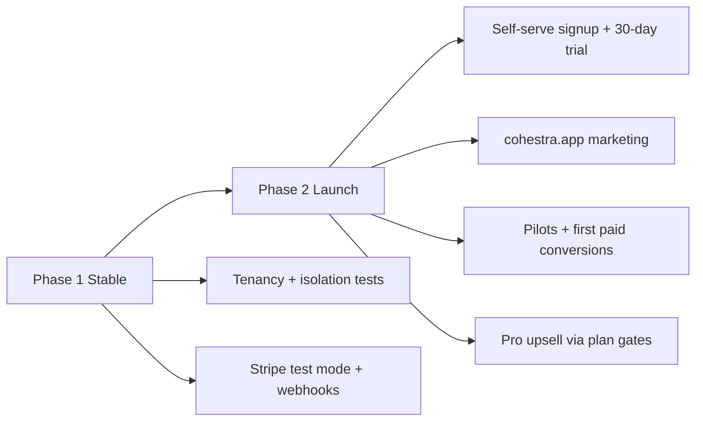

# PRD: Cohestra Enterprise

*Multi-tenant enterprise SaaS — distinct from the single-operator **lead-generation-crm** product.*

## 0. Document Purpose

This PRD defines **Cohestra Enterprise** — a multi-tenant SaaS platform where many **Tenant Organizations** run isolated community-event and lead-capture operations on shared infrastructure.

It is written for product stakeholders, architects, UX, and implementation agents building in the **Cohestra** repository via Cursor Cloud and local development.

**Structure:** Glossary-anchored vocabulary, globally numbered **Functional Requirements (FRs)**, **User Journeys (UJ-N)**, and **Success Metrics (SM-N)**. Assumptions are tagged `[ASSUMPTION]` and indexed in §9. Mechanism and transport choices live in `addendum.md`.

**Inputs:**
- Sprint Change Proposal `sprint-change-proposal-2026-07-14.md` (enterprise pivot)
- Inherited single-operator PRD `prd-lead-generation-crm-2026-06-14/prd.md` (Platform 0 domain features)
- Brownfield codebase: Epics 1–10 complete (activities, clients, campaigns, reports, website builder)

**Product boundary:** This PRD does **not** govern **lead-generation-crm** — a separate single-operator product that continues in its own repository.

---

## 1. Vision

Community and activity-driven organizations capture leads through events, QR registrations, and referral-driven sign-ups — but when each organization runs isolated spreadsheets, forms, and messaging tools, growth data fragments and operational cost scales linearly with headcount.

**Cohestra Enterprise** is a multi-tenant platform: each **Tenant Organization** gets a fully isolated workspace with branded public surfaces, operator accounts, activities, client lists, campaigns, and reports — without sharing data with other tenants. The platform operator (Creativorare / Cohestra team) provisions and governs tenants while tenant admins run day-to-day community operations.

The inherited **Platform 0** codebase already implements the activity-engine CRM for one operator. Enterprise v1 adds the **tenancy spine** so that capability serves many organizations safely on one deployment.

**Platform promise (enterprise):** Every tenant's activities become measurable lead-generation engines with **no cross-tenant data leakage** and **no lost context** after registration.

### Why Now

- Platform 0 proves domain value (activities, dedup, campaigns, site builder) on working brownfield code.
- Market positioning shifts from one-off client builds to **repeatable enterprise SaaS**.
- Multi-tenant isolation is a prerequisite for production SaaS revenue and operational scale.

---

## 2. Target User

### 2.1 Jobs To Be Done

**Tenant admin (organization operator)**
- Stand up a branded community-events workspace without engineering help.
- Invite colleagues to operate activities and follow up on leads under RBAC.
- Run activities, registrations, campaigns, and reports with confidence that data stays inside the organization.
- Configure public homepage and registration flows per tenant brand.

**Tenant member (operator)**
- Perform day-to-day activity and client operations within permissions granted by tenant admin.
- See only data belonging to their **Tenant Organization**.

**Platform admin (Cohestra operator)**
- Provision, suspend, and monitor **Tenant Organizations** on shared infrastructure.
- Investigate support issues without routine access to tenant business data `[ASSUMPTION: break-glass audit only, not default]`.

**Activity participant (public registrant)**
- Register for tenant activities via mobile-friendly public pages scoped to the correct organization.
- Receive confirmation with registration number; no account required.

### 2.2 Non-Users (enterprise v1)

- **lead-generation-crm operators** — use the separate single-operator product; not Cohestra Enterprise tenants.
- **Self-serve marketplace buyers comparing CRM categories** — enterprise v1 targets activity-led community operators, not horizontal sales CRM.
- **Participant self-service portals** — participants do not log in; public registration only.
- **End-customer billing self-management** — deferred (see §6.2).

### 2.3 Key User Journeys

- **UJ-1. Priya provisions Ikigai Sports as a new tenant.**
  - **Persona + context:** Priya, operations lead at Ikigai Sports, signing up after a sales demo.
  - **Entry state:** Unauthenticated; marketing site → tenant signup.
  - **Path:** Completes organization name, admin email, password → verifies email OTP → lands in empty tenant dashboard → completes brand accent and site name in settings → creates first **Activity**.
  - **Climax:** Public URL `https://ikigai.cohestra.app/` (or assigned subdomain) shows Ikigai branding; Priya is **Tenant Admin**.
  - **Resolution:** Tenant workspace ready; Platform 0 features available inside tenant scope.
  - **Edge case:** Subdomain slug collision — system suggests alternatives before commit.

- **UJ-2. Priya invites Marco as a second operator.**
  - **Persona + context:** Priya needs help running weekend clinics.
  - **Entry state:** Authenticated **Tenant Admin**.
  - **Path:** Settings → Team → invite email → Marco receives invite → sets password → logs in with **Tenant Member** role.
  - **Climax:** Marco sees dashboard and clients for Ikigai only; cannot access tenant settings or billing.
  - **Resolution:** Multi-user operations without sharing passwords.
  - **Edge case:** Invite expires after 7 days; Priya can resend.

- **UJ-3. Elena registers at Ikigai's Sunday clinic (unchanged participant flow, tenant-scoped).**
  - **Persona + context:** Elena scans QR at venue.
  - **Entry state:** Mobile browser on `https://ikigai.cohestra.app/register/sunday-clinic`.
  - **Path:** Completes form → sees registration number → Client dedup runs within **Ikigai tenant only**.
  - **Climax:** Registration stored under Ikigai; no visibility to other tenants' clients.
  - **Resolution:** Priya sees Elena on Ikigai dashboard.
  - **Edge case:** Same phone registered at a *different tenant* creates a separate **Client** — cross-tenant dedup is intentionally not performed.

- **UJ-4. Platform admin suspends a tenant for non-payment.**
  - **Persona + context:** Cohestra platform operator handling billing exception.
  - **Entry state:** Platform admin console.
  - **Path:** Locates tenant → sets status **Suspended** → public pages show maintenance message; tenant admins cannot log in.
  - **Climax:** Other tenants unaffected; audit log records suspension actor and reason.
  - **Resolution:** Reactivation restores access without data loss.

---

## 3. Glossary

- **Platform** — The shared Cohestra Enterprise deployment (API, web, database, cache, email infrastructure) hosting all tenants.

- **Platform Admin** — Cohestra operator with cross-tenant administration rights (provision, suspend, support). Distinct from **Tenant Admin**.

- **Tenant** — An isolated organization workspace on the Platform. Owns all business data (activities, clients, registrations, campaigns, site configuration). Identified by immutable `TenantId` and a unique **Tenant Slug** used in routing.

- **Tenant Organization** — The business entity represented by a **Tenant** (e.g., Ikigai Sports, TGH Tennis Club). Synonym: **Organization** in UI copy maps to **Tenant**.

- **Tenant Admin** — Authenticated user with full administrative rights within one **Tenant** (settings, team, branding, all operational modules).

- **Tenant Member** — Authenticated user with operational rights within one **Tenant** (activities, clients, campaigns, reports) but not tenant administration.

- **Tenant Slug** — URL-safe unique identifier for a **Tenant** (e.g., `ikigai-sports`). Used for subdomain routing `[ASSUMPTION: {slug}.cohestra.app]`.

- **Tenant Context** — Runtime resolution of which **Tenant** a request operates on, derived from host header (subdomain) and/or authenticated JWT `tenant_id` claim.

- **Platform 0** — Inherited single-operator feature set (Epics 1–10) implemented in the brownfield codebase before enterprise tenancy. Becomes **tenant-scoped modules** under this PRD.

- **Activity**, **Client**, **Registration**, **Campaign**, **Report**, **Community**, **Category**, **Form**, **QR Code**, **Lead Status**, **Registration number**, **Site Page** — Domain terms as defined in Platform 0 PRD, with the constraint that all instances are scoped to exactly one **Tenant**.

- **Community** — An operator-defined program or brand **within one Tenant** (e.g., "Running Club", "Youth Program", "Pickleball"). Managed in **Activities → Communities**; activities store a `CommunityLabel`; used for filters, reports, and campaigns. **Not** a separate tenant, subdomain, login, or billing account. **Terminology policy (Option A):** **Community** is the official product term in UI, PRD, pricing limits, and support. Marketing may say "club" or "program" in prose; those words always refer to a **Community** in the app.

- **Data isolation** — Guarantee that no API query, cache key, or export returns another **Tenant**'s records.

---

## 4. Features

### 4.1 Tenant Provisioning & Lifecycle

**Description:** The Platform supports creating and managing **Tenant** workspaces. Realizes UJ-1, UJ-4.

#### FR-1: Self-serve tenant signup

A prospective **Tenant Admin** can register a new **Tenant Organization** with organization name, **Tenant Slug**, admin email, and password. Realizes UJ-1.

**Consequences (testable):**
- Successful signup creates **Tenant** row, default **Site Page** seed, and first **Tenant Admin** user.
- **Tenant Slug** is globally unique; collision returns validation error with suggestions.
- Email verification required before admin dashboard access.
- Signup is disabled when Platform sets `registrationClosed=true` `[ASSUMPTION: sales-led tenants created by Platform Admin when self-serve disabled]`.

#### FR-2: Platform-admin tenant provisioning

A **Platform Admin** can create, suspend, reactivate, and archive **Tenants** without using self-serve signup. Realizes UJ-4.

**Consequences (testable):**
- Suspended tenant blocks tenant admin login and returns maintenance state on public routes.
- Archived tenant is read-only for 30 days then hard-deleted per retention policy `[ASSUMPTION: 30-day soft archive]`.
- All lifecycle changes append to platform audit log with actor, timestamp, reason.

#### FR-3: Tenant status machine

Each **Tenant** has status: `Active`, `Suspended`, `Archived`.

**Consequences (testable):**
- Only `Active` tenants accept public registrations and admin writes.
- `Suspended` allows Platform Admin read-only inspection.
- Status transitions are idempotent and audited.

---

### 4.2 Identity, Access & RBAC

**Description:** Multi-user access per **Tenant** with role-based permissions. Replaces Platform 0 single-operator enforcement. Realizes UJ-2.

#### FR-4: Tenant-scoped authentication

An authenticated user session is bound to exactly one **Tenant** via JWT `tenant_id` claim (admin routes) or **Tenant Context** resolution (public routes).

**Consequences (testable):**
- Login fails with clear error if user has no membership in resolved tenant.
- Token refresh preserves `tenant_id`.
- User may belong to multiple tenants `[ASSUMPTION: v1 UI shows one tenant per session; tenant switcher deferred to v1.1]`.

#### FR-5: Tenant roles

**Tenant Admin** and **Tenant Member** roles govern access within a tenant.

**Consequences (testable):**
- **Tenant Admin** can invite/remove members, change tenant settings, manage SendGrid sender config.
- **Tenant Member** cannot access team management or destructive tenant settings.
- Role checks enforced server-side on every admin endpoint (not UI-only).

#### FR-6: Team invitation

A **Tenant Admin** can invite users by email to join the **Tenant** with a specified role. Realizes UJ-2.

**Consequences (testable):**
- Invite token expires in 7 days.
- Accepting invite creates tenant membership; no duplicate global operator block.
- Revoked invite cannot be reused.

#### FR-7: Platform admin role

A **Platform Admin** role exists distinct from tenant roles, gated to platform routes only.

**Consequences (testable):**
- Platform routes reject tenant JWTs without platform claim.
- Platform Admin cannot impersonate tenant admin without audited break-glass `[ASSUMPTION: break-glass deferred — platform admin manages metadata only in MVP]`.

---

### 4.3 Tenant Data Isolation

**Description:** Hard guarantee that tenants cannot read or mutate each other's data. Foundational enterprise requirement.

#### FR-8: Tenant-scoped data model

Every Platform 0 business entity (Activity, Client, Registration, Campaign, Community, Category, SitePage, EmailTemplate, etc.) stores non-nullable `TenantId`.

**Consequences (testable):**
- Database migration adds `TenantId` with backfill to a `default` tenant for dev/staging rows.
- Composite unique constraints include `TenantId` where slugs or codes are unique (e.g., Activity slug).
- EF Core global query filter applies `TenantId` on all tenant-scoped entities.

#### FR-9: Tenant context middleware

Every API request resolves **Tenant Context** before business logic executes.

**Consequences (testable):**
- Missing or unknown tenant returns 404 on public routes, 403 on admin routes.
- Integration test suite includes cross-tenant negative cases (tenant A token cannot read tenant B activity by ID).
- Redis cache keys are namespaced by `TenantId`.

#### FR-10: Export and report isolation

CSV exports and reports include only records for the authenticated **Tenant**.

**Consequences (testable):**
- Export of 10,000 rows from tenant A contains zero tenant B IDs.
- Report aggregation queries always filter by `TenantId`.

---

### 4.4 Tenant Routing & Public Surfaces

**Description:** Each **Tenant** has branded public entry points. Replaces deployment-wide singleton SitePage. Realizes UJ-1, UJ-3.

#### FR-11: Subdomain tenant routing

Public and admin web surfaces resolve **Tenant** from subdomain `{tenant-slug}.cohestra.app`. `[ASSUMPTION: apex domain hosts marketing + signup only]`

**Consequences (testable):**
- `https://ikigai.cohestra.app/` renders Ikigai **Site Page**.
- `https://ikigai.cohestra.app/register/{activity-slug}` scopes activity lookup to Ikigai.
- Local dev supports `{slug}.localhost` or `?tenant=` override documented in addendum.

#### FR-12: Per-tenant Site Page

Each **Tenant** has its own **Site Page** draft/publish lifecycle (inherited Website Builder behavior, tenant-scoped).

**Consequences (testable):**
- Publishing Ikigai site does not affect TGH tenant homepage.
- Preview token is scoped to tenant site draft.
- Seed on tenant creation produces default Cohestra-branded starter content overridable by tenant admin.

#### FR-13: Per-tenant email branding

SendGrid sender identity and email footer branding are configurable per **Tenant** within platform guardrails.

**Consequences (testable):**
- Campaign sent from Ikigai uses Ikigai's configured From name/email.
- Platform blocks send if tenant sender not verified (inherited delivery checklist, tenant-scoped).

---

### 4.5 Inherited Platform 0 Capabilities (Tenant-Scoped)

**Description:** The following Platform 0 feature areas remain in enterprise v1, executed **within Tenant Context**. Detailed FRs (activity engine, master client list, dashboard, reports, campaigns, WhatsApp click-to-message, website builder sections) are defined in `prd-lead-generation-crm-2026-06-14/prd.md` (FR-1 through FR-20+). This PRD adds tenancy preconditions only.

**Functional Requirements:**

#### FR-14: Tenant-scoped activity engine

All Activity Engine capabilities (create activity, form schema, QR, public registration, registration numbers, dedup) operate within the resolved **Tenant**. Realizes UJ-3.

**Consequences (testable):**
- Activity slug unique per tenant, not globally.
- Registration dedup matches clients within tenant only.
- All Platform 0 registration ingestion tests pass with `TenantId` injected.

#### FR-15: Tenant-scoped operations dashboard and reports

Dashboard metrics, reports, and CSV export reflect only the current **Tenant** data.

**Consequences (testable):**
- Dashboard totals for tenant A unchanged when tenant B receives registrations.
- Inherited 60s polling and cache TTL behavior preserved per tenant cache namespace.

#### FR-16: Tenant-scoped campaigns and templates

Email templates, segments, and campaign sends are tenant-private.

**Consequences (testable):**
- Segment preview counts only tenant clients.
- Campaign history on client profile shows only tenant campaigns.

---

### 4.6 Platform Administration

**Description:** Minimal console for **Platform Admin** to operate the SaaS. Realizes UJ-4.

#### FR-17: Tenant directory

A **Platform Admin** can list tenants with status, slug, created date, admin contact, and aggregate counts (activities, clients — not PII export by default).

**Consequences (testable):**
- Search by slug and organization name.
- Pagination on tenant list.

#### FR-18: Platform health and audit

Platform exposes health endpoints and immutable audit log for tenant lifecycle and platform admin actions.

**Consequences (testable):**
- `/ready` remains unauthenticated; tenant-aware readiness checks default tenant connectivity.
- Audit entries include actor, action, tenantId, timestamp.

---

### 4.7 Billing & Subscriptions

**Description:** Self-serve subscription lifecycle via Stripe. Realizes monetization in §13.

#### FR-19: Free Basic signup and paid Core/Pro subscriptions

**Basic (free):** A prospective **Tenant Admin** can self-serve signup on **Basic** with **no payment method** and **no Stripe subscription**. `Tenant.Plan = Basic`, `BillingStatus = Free`.

**Core / Pro (paid):** Upgrade or direct signup on Core or Pro completes **Stripe Checkout** with a **30-day trial** and payment method on file. No charge until trial ends.

**Consequences (testable):**
- Basic signup: email verification only; no Stripe Customer created until first paid upgrade.
- Paid signup disclaimer: *"You will not be charged while your trial is active. Billing starts on {trial_end_date} unless you cancel."*
- `Tenant.BillingStatus` ∈ `Free` (Basic), `Trialing`, `Active`, `PastDue`, `OnHold`, `Canceled`.
- Paid tiers: `StripeCustomerId` and `StripeSubscriptionId` stored; plan synced from Stripe webhooks.
- Stripe **test mode** (sandbox) in local dev and CI; live mode production only.
- Basic → Core/Pro upgrade initiates Stripe Checkout; limits lift per new plan on successful subscription.

#### FR-20: USD-only billing

All subscription prices, Checkout, invoices, and billing UI are denominated in **USD**, regardless of tenant admin location.

**Consequences (testable):**
- Stripe Prices use `currency: usd` only for **Core and Pro** (monthly and annual).
- Marketing and signup display USD; no geo-based currency conversion in v1.
- `Tenant.BillingCurrency` fixed to `USD` (or omitted; USD implied).

#### FR-21: Trial expiration reminders

During the **last 7 days** of trial (`trial_end` − 7 days through `trial_end`), the system sends **one email per day** and shows an **in-app notification** to all Tenant Admins stating that the trial expires soon and the exact expiration date/time.

**Consequences (testable):**
- Day 7, 6, 5, 4, 3, 2, 1 before `trial_end`: email + in-app banner for tenant admins.
- Notification copy includes `{trial_end_date}` and link to billing portal (Stripe Customer Portal).
- After trial end without cancel: Stripe attempts first charge; success → `Active`.

#### FR-22: Monthly and annual billing

Tenants choose **monthly** or **annual** billing at signup or via Customer Portal. Annual plans receive a **discount** vs 12× monthly `[ASSUMPTION: 2 months free — pay 10 months, get 12; confirm in pricing study §13.10]`.

**Consequences (testable):**
- Stripe Prices exist for **Core/Pro** × monthly/annual only. **Basic has no Stripe Price.**
- Checkout and Portal expose both intervals; webhook syncs `BillingInterval` on `Tenant`.
- Annual renewal date = subscription `current_period_end`.

#### FR-23: Delinquency lifecycle (8-week window)

If payment fails at trial end or on renewal, the tenant enters a structured **4-week follow-up** after the **~4-week trial**, for **8 weeks total** from trial start:

| Week (from trial start) | `BillingStatus` | Operator experience | Notifications |
|-------------------------|-----------------|---------------------|---------------|
| **1–4** | `Trialing` | Full access | Daily email + in-app in **last 7 days** of trial (FR-21) |
| **5** | `PastDue` | Full access — last chance to pay | **Daily** email + in-app: settle bill to continue |
| **6–8** | `OnHold` | **Read-only** — account on hold | **Once per week** email + in-app: settle to restore |
| **After week 8** | `Deleted` | Account removed | Final notice; tenant data deleted per §9 |

**Consequences (testable):**
- End of week 5: transition to `OnHold`; admin UI shows hold banner with link to Customer Portal.
- Successful payment during `PastDue` or `OnHold` → `Active`; full access restored.
- After week 8 without payment: soft-delete tenant; subdomain returns 404; data purged per retention policy.
- All state transitions logged in audit trail.

---

## 5. Non-Goals (Explicit)

- **Modifying lead-generation-crm** — separate product; no shared deployment requirement.
- **Cross-tenant client deduplication** — same person at two tenants is two **Clients** by design.
- **Participant login / member portals** — public registration only.
- **WhatsApp Business API** — deferred; click-to-message retained from Platform 0.
- **Automated email drip sequences** — deferred to enterprise v2.
- **Custom report builder** — deferred; inherited filters + CSV sufficient for v1.
- **Enterprise custom contracts in-app** — sales-led deals use manual invoice; self-serve **Basic is free**; **Core / Pro** via Stripe.
- **Tenant custom domains** (`events.ikigai.com`) — deferred to v1.1; subdomain only in v1.
- **Fine-grained custom RBAC** (per-module permissions builder) — Admin vs Member only in v1.

---

## 6. MVP Scope

### 6.1 In Scope (Cohestra Enterprise v1)

- **Tenancy spine:** Tenant entity, `TenantId` on core tables, middleware, EF filters, integration tests
- **Self-serve + platform-admin provisioning** (FR-1, FR-2)
- **Subdomain routing** per tenant (FR-11)
- **Multi-user RBAC:** Tenant Admin + Tenant Member (FR-4–FR-6)
- **Platform Admin** minimal tenant directory + suspend/reactivate (FR-2, FR-17)
- **Per-tenant Site Page** and public registration (FR-12, FR-14)
- **All Platform 0 operational modules** tenant-scoped (FR-14–FR-16)
- **Migration path:** default tenant backfill for existing dev/staging data
- **Cohestra cloud development** workflow (Cursor Cloud Agents + GitHub); no droplet deployment required for v1 dev
- **Free Basic tier** signup without Stripe (FR-19)
- **Plan gates** (`Tenant.Plan`) wired to Stripe subscription state

### 6.2 Out of Scope for MVP

| Item | Reason |
|------|--------|
| Usage-based billing / per-registration metering | Flat tier pricing sufficient for v1 |
| Seat metering automation beyond Stripe quantity | Manual seat add-on via portal in v1.1 if needed |
| Custom domains per tenant | Subdomain sufficient for v1 launch |
| Tenant switcher (multi-tenant users) | Rare in v1; one session = one tenant |
| Platform Admin impersonation | Break-glass deferred; audit complexity |
| Schema-per-tenant isolation | Shared DB + `TenantId` sufficient for v1 scale target |
| SOC 2 / formal compliance certification | Post-revenue; design for auditability only |
| lead-generation-crm feature parity fork | Products diverge by design |

### 6.3 Platform 0 Baseline (Already Built)

Epics 1–10 delivered: API-first stack, activities, clients, dedup, dashboard, reports, campaigns, SendGrid, website builder, landing sections. **No rollback.** Enterprise work adds tenancy layer and refactors scoping.

---

## 7. Success Metrics

**Primary**
- **SM-1:** Zero cross-tenant data leakage in integration test matrix — 100% pass on negative cross-tenant cases. Validates FR-8, FR-9.
- **SM-2:** Tenant signup → first published activity → public registration E2E completes in &lt; 15 minutes for a prepared admin. Validates FR-1, FR-11, FR-14.
- **SM-3:** Two tenants on same deployment with 100+ clients each; dashboard p95 &lt; 3s. Validates FR-15, NFR performance.

**Secondary**
- **SM-4:** 90% of Platform 0 unit tests pass without modification after tenancy migration (remaining failures addressed in Epic 11–13). Validates brownfield preservation.
- **SM-5:** Tenant admin invites member; member completes activity creation without admin intervention. Validates FR-6, FR-5.

**Counter-metrics (do not optimize)**
- **SM-C1:** Total tenant count — do not optimize at expense of isolation test coverage (SM-1).
- **SM-C2:** Signup conversion rate — do not remove email verification or isolation checks to inflate conversion.

---

## 8. Cross-Cutting NFRs

| Category | Requirement |
|----------|-------------|
| **Security** | Tenant isolation enforced server-side; no tenant ID in client-trusted headers without signature; JWT `tenant_id` validated on every admin request |
| **Performance** | Public registration &lt; 2s p95; tenant dashboard &lt; 3s p95 with Redis cache per tenant |
| **Reliability** | Tenant suspension does not impact other tenants' availability |
| **Privacy** | Tenant data export on request; platform admin cannot bulk-export tenant PII in MVP |
| **Observability** | Structured logs include `tenantId` on all business operations; audit trail for lifecycle |
| **Scalability** | Architecture supports 100 active tenants / 100k clients total on single deployment `[ASSUMPTION: v1 scale target]` |

---

## 9. Data Governance

- **Residency:** Single region deployment (Singapore-adjacent) for v1 `[ASSUMPTION: DigitalOcean Singapore when deployed]`.
- **Retention:** Voluntary cancel → soft-delete 30 days then purge. **Billing delinquency** → delete after **8 weeks** from trial start per FR-23. Registrations immutable per Platform 0 rules until tenant purge.
- **Classification:** Client contact data = confidential per tenant; platform audit logs = internal.
- **Export:** Tenant Admin can export own tenant CSV reports; cross-tenant export prohibited.

---

## 10. Risk and Mitigations

| Risk | Impact | Mitigation |
|------|--------|------------|
| Cross-tenant data leak | Critical | FR-8/9, mandatory integration tests, code review gate |
| Brownfield refactor breaks Platform 0 | High | Default tenant migration; incremental Epic 11–13; SM-4 |
| Subdomain routing complexity on local dev | Medium | Document `*.localhost` and env overrides in addendum |
| Single-operator code paths remain | Medium | Remove `AuthService` single-operator gate in Epic 12 |
| Scope creep into billing/SSO | Medium | Stripe MVP scope locked in FR-19–21; Enterprise manual only |
| Stripe webhook mis-sync | Medium | Idempotent handlers; reconcile job; test mode in CI |
| Delinquency job misfire deletes active tenant | High | State machine tests; manual Platform Admin override before delete |

---

## 11. Open Questions & Research

**Resolved:**

| # | Topic | Decision |
|---|-------|----------|
| Q1 | Signup | **Open self-serve** at launch |
| Q3 | Currency | **USD only** — all prices and charges in USD globally |
| Q4 | Country detection | **Dropped** — no geo currency logic |
| Q9 | Post-trial / failed payment | **8-week lifecycle** — see FR-23 and §13.5 |
| Q10 | Billing intervals | **Monthly + annual**; annual discounted |
| Q6–8 | Slugs, SendGrid, droplet | Confirmed per addendum / deferred deploy |
| **Terminology** | **Community** vs club | **Option A ratified** — **Community** official in product/pricing; "club" only as example community name in marketing |

**Deferred — pricing & packaging study (before scale, not blocking MVP build):**

| # | Topic | Plan |
|---|-------|------|
| **Q2** | **Intro vs list price & grandfathering** | **Research draft done** — launch at $29/$79 and $290/$790; pilot WTP interviews + grandfather rules before list-price increase. See `research/market-cohestra-pricing-penetration-research-2026-07-16.md`. |
| **Q5** | **Communities, activities, registration caps** | **Ratified Option 1** — see §13.4; Basic / Core / Pro ladder |

**Pricing study deliverable:** `bmad-market-research` or focused pricing memo — competitor matrix, unit economics, recommended intro/list/annual discount, grandfather rules. Target: before Phase 3 scale (§13.2).

**Registration cap study deliverable:** Per-tenant registration volume model vs plan gates; output updates §13.3 soft caps and `Tenant.Plan` flags.

---

## 12. Assumptions Index

- **A-1:** Subdomain routing `{slug}.cohestra.app` — §4.4 FR-11
- **A-2:** Shared database + `TenantId` row isolation — §4.3 FR-8
- **A-3:** Stripe self-serve billing in MVP; Enterprise tier manual invoice — §4.7, §6.1
- **A-4:** Tenant switcher deferred; one tenant per session — §4.2 FR-4
- **A-5:** Platform Admin break-glass impersonation deferred — §4.2 FR-7
- **A-6:** 30-day soft archive before tenant hard delete — §4.1 FR-2
- **A-7:** v1 scale: 100 tenants, 100k clients — §8
- **A-8:** Default tenant backfill for existing dev data — §6.1
- **A-9:** lead-generation-crm remains separate product — §0, §5
- **A-10:** Three self-serve tiers Basic / Core / Pro; website builder Pro-only — §13
- **A-11:** Introductory pricing Basic **$15** / Core **$29** / Pro **$79** (USD); list price TBD — §13.3
- **A-12:** 30-day trial, card on file, no charge until trial ends — §13.5, FR-19
- **A-13:** Trial expiration: daily email + in-app notice in last 7 days — FR-21
- **A-14:** All billing in **USD only** — FR-20
- **A-15:** Stripe test mode for dev/CI; live mode production only — FR-19, addendum
- **A-17:** Monthly + annual billing; annual ≈ 2 months free — FR-22
- **A-18:** Delinquency: week 5 daily collection → weeks 6–8 hold + weekly nudge → delete after week 8 — FR-23
- **A-19:** Open self-serve signup at launch — §13.7
- **A-20:** Usage limits (Option 1): Basic 1 comm / 4 activities / 150 reg·mo · Core 3 / 12 / 500 · Pro 10 / 50 / 5,000 — §13.4
- **A-21:** Official term **Community** (not "club") in UI, PRD, pricing limits — §3 glossary; marketing may use "club" as example name only

---

## 13. Go-to-Market & Monetization Strategy

### 13.1 Positioning

**One-line:** Cohestra turns community events and QR registrations into one client list with follow-up — without Google Forms chaos.

**Primary audience (v1):** Community clubs, fitness studios, and hobby groups running multiple activities per month with 1–5 operators.

**Competitive frame:**

| Alternative | Cohestra advantage |
|-------------|-------------------|
| Google Forms + spreadsheet | Unified client list, dedup, timeline, campaigns |
| Peatix / Luma | CRM pipeline after registration, not just event pages |
| Generic CRM (HubSpot, etc.) | Activity-led capture built-in; no deal-desk complexity |

**Product boundary in all marketing:** Cohestra Enterprise (this product) is multi-tenant SaaS. **lead-generation-crm** is a separate single-operator product — never conflated in copy or demos.

### 13.2 Phased route (stable → market → monetize)



| Phase | Goal | Exit criteria |
|-------|------|---------------|
| **1 — Stable** | Safe multi-tenant platform + billing plumbing | Cross-tenant tests pass; Stripe sandbox Checkout E2E; webhooks update `Tenant.Plan` |
| **2 — Launch** | Discoverable self-serve funnel with revenue | cohestra.app live; signup → trial → first activity E2E; ≥1 paying tenant after trial |
| **3 — Scale** | Optimize conversion and pricing | Intro price review; target list price rollout per market signal |

### 13.3 Pricing tiers

**Freemium + paid ladder** (USD for paid tiers) + optional sales-led **Enterprise**.

| Tier | Price | Target buyer |
|------|-------|--------------|
| **Basic** | **Free forever** | Prospects testing Cohestra at minimum viable footprint — one person, one community, a few live events |
| **Core** | **$29** / mo · **$290** / yr (2 mo free) | Small org ready to commit; 3 communities, small team |
| **Pro** | **$79** / mo · **$790** / yr (2 mo free) | Marketing, campaigns, custom site, high volume |
| **Enterprise** | Custom (manual invoice) | Custom limits, domain, SSO |

**Default signup:** **Basic (free)** — lowest friction to test product. Upgrade prompts when limits hit or operator needs Core/Pro features.

**Upgrade path:** Basic (free) → Core (trial + paid) → Pro (trial + paid).

**Seat add-ons:** +$15 / month per operator beyond tier limit (**Core:** 3; **Pro:** 10). Basic cannot purchase extra seats — must upgrade to Core.

### 13.4 Feature gates by tier

**Usage limits (ratified):** Published activities = **concurrent Published status**. Registrations = **public registrations per calendar month (UTC)**. Warn at **80%**, block at **100%**. **Basic:** enforce immediately. **Paid tiers:** soft warn during trial, enforce after trial ends.

| Capability | Basic | Core | Pro |
|------------|:-----:|:----:|:---:|
| **Price** | **Free** | $29/mo | $79/mo |
| Activities + QR + public registration | ✓ | ✓ | ✓ |
| Client dedup + timeline | ✓ | ✓ | ✓ |
| Dashboard + reports + CSV | ✓ | ✓ | ✓ |
| **Registration email notifications** | ✓ | ✓ | ✓ |
| **Email campaigns** | — | — | ✓ |
| **Operator seats** | **1** | **3** | **10** |
| **Communities** | **1** | **3** | **10** |
| **Published activities (concurrent)** | **3** | **12** | **50** |
| **Registrations / month (public)** | **150** | **500** | **5,000** |
| Public site — **fixed template** | ✓ | ✓ | — |
| Public site — **website builder** | — | — | ✓ |
| Custom domain / SSO / SLA | — | — | Enterprise |

**Basic tier purpose:** Let potential users **test the real product** — real QR, real client list, real registration emails, fixed public site — at the **smallest safe footprint** without payment friction.

**Email:** Registration notifications on **all tiers**. Campaigns **Pro only**.

**Public site:** Fixed template on **Basic & Core**. Website builder **Pro only**.

Implementation: `Tenant.Plan` ∈ `Basic`, `Core`, `Pro`, `Enterprise`. **Basic** has no Stripe subscription; **Core/Pro** synced from Stripe webhooks.

### 13.5 Billing & trial (Stripe)

| Concern | Decision |
|---------|----------|
| **Basic** | **Free forever** — signup without card or Stripe; `BillingStatus = Free` |
| **Core / Pro** | Stripe Checkout + Customer Portal + webhooks |
| **Currency** | **USD only** for paid tiers (FR-20) |
| **Intervals** | Monthly and annual on Core/Pro (FR-22) |
| **Trial length** | **30 days** on **Core or Pro** signup/upgrade only |
| **Payment method** | **Required for Core/Pro**; not required for Basic |
| **Trial reminders** | Daily email + in-app last 7 days (FR-21) — paid tiers only |
| **Post-trial failure** | 8-week delinquency lifecycle (FR-23) — paid tiers only |
| **Enterprise** | Manual invoice |

**Delinquency timeline (from trial start):**

```mermaid
gantt
  title Tenant billing lifecycle (weeks from trial start)
  dateFormat X
  axisFormat Week %s
  section Access
  Full access (trial)           :0, 4
  Full access (past due)        :4, 5
  Read-only hold                :5, 8
  section Notify
  Daily (trial last 7 days)     :3, 4
  Daily (week 5 collect)        :4, 5
  Weekly (weeks 6-8 hold)       :5, 8
  Delete after week 8           :milestone, 8, 0
```



| Week | Status | Access | Notifications |
|------|--------|--------|---------------|
| 1–4 | `Trialing` | Full | Daily in last 7 days of trial |
| 5 | `PastDue` | Full | **Daily** — settle bill to continue |
| 6–8 | `OnHold` | Read-only | **Weekly** — account on hold, settle to restore |
| 8+ | `Deleted` | None | Final notice; tenant data deleted |

**Stripe objects (v1):** Products `cohestra_core`, `cohestra_pro` only; USD Prices monthly + annual; Subscription with `trial_period_days: 30`. **Basic:** no Stripe product.

### 13.6 Marketing funnel

```
cohestra.app (apex marketing)
  → Start free on Basic (no card)
  → Self-serve signup → first activity + QR in <15 min (SM-2)
  → Hit limit or need team/campaigns → Upgrade to Core/Pro (30-day trial + card)
  → Trial reminders (last 7 days) on paid tiers
```

**Minimum marketing assets:**

- Landing page: problem, demo (90s), pricing (§13.3), signup CTA
- Comparison: vs Google Forms + spreadsheet
- Case study: 1 pilot tenant (post Phase 2)
- SEO targets: "event registration CRM", "community lead capture", "QR event registration"

### 13.7 Launch sequencing (product + GTM)

1. Tenancy spine + isolation (Epic 11–13) — **blocks everything**
2. **Stripe sandbox** + webhooks + plan sync + delinquency jobs (FR-19–23)
3. Open self-serve signup + USD Checkout (monthly/annual) + 30-day trial
4. cohestra.app marketing + pricing (Free Basic / Core $29 / Pro $79)
5. 2–3 pilot tenants on trial
6. Tenant-scoped website builder → **Pro upsell**
7. **Pricing study (§13.9)** before list-price / grandfather rollout
8. Scale content + outbound

### 13.8 GTM success metrics

- **SM-G1:** 3 pilot tenants complete 2+ activities without platform support intervention
- **SM-G2:** First paid conversion after trial (`invoice.paid`)
- **SM-G3:** ≥1 Pro upgrade driven by website-builder gate
- **SM-G4:** Trial reminder emails delivered on days 7–1 before expiration (100% for active trials)
- **SM-G5:** Delinquency notifications fire on schedule (daily week 5; weekly weeks 6–8)
- **SM-CG1:** Do not optimize signup volume over SM-1 (isolation)

### 13.9 Pricing & packaging study (Q2, Q5)

**Status:** Initial market research complete — `research/market-cohestra-pricing-penetration-research-2026-07-16.md`

| Workstream | Status | Key finding |
|------------|--------|-------------|
| **Market penetration pricing (Q2)** | **Draft complete** | Launch **$29/$79** and **$290/$790** annual (2 mo free) is **reasonable**; grandfather policy still needs pilot WTP interviews |
| **Registration economics (Q5)** | **Ratified** | Option 1 limits; Basic / Core / Pro ladder — §13.4, §13.10 |

**Annual pricing verdict ($290 Core / $790 Pro):**

- **Annual math is correct** — both tiers use the same **16.7% discount** (2 months free); industry standard.
- The **“huge difference”** is the **Core→Pro gap ($500/yr)**, not broken annual pricing.
- **Market with monthly equivalents:** Core **$24/mo** billed annually; Pro **$66/mo** billed annually.
- **Pro $790** is ~**37% below** a Luma + Mailchimp stack (~$1,248/yr); **Core $290** is above free Peatix — sell CRM ROI, not event pages.

**If Pro upgrade &lt; 15% after 10 tenants:** test Pro intro at **$69/mo ($690/yr)** before adding a middle tier.

### 13.10 Usage limits reference (Option 1 — ratified)

| Limit | Basic (free) | Core | Pro |
|-------|:------------:|:----:|:---:|
| Operator seats | 1 | 3 | 10 |
| Communities | 1 | 3 | 10 |
| Published activities (concurrent) | **3** | 12 | 50 |
| Registrations / month (public) | 150 | 500 | 5,000 |

**Basic rationale:** Minimum real product test — one operator, one community, three live events, 150 regs/mo, registration emails, fixed site. No card required.

Full pricing page copy: `docs/marketing/pricing-tiers.md`

---

## 14. Downstream Handoff

| Next skill | Deliverable | Status |
|------------|-------------|--------|
| `bmad-architecture` | Tenancy spine — isolation, routing, identity, migration | **Done** — `architecture/architecture-cohestra-enterprise-2026-07-15/` |
| `bmad-ux` | Enterprise journeys — signup, team invite, platform admin | Pending |
| `bmad-create-epics-and-stories` | Epic 11–15 breakdown from this PRD | Pending |
| `bmad-market-research` | Pricing penetration + registration economics (§13.9) | **Draft done** — `research/market-cohestra-pricing-penetration-research-2026-07-16.md`; pilot WTP interviews pending |
| `bmad-check-implementation-readiness` | Align PRD + architecture + UX before dev | After UX |
| `bmad-sprint-planning` | Enterprise sprint status | After epics |
| Pricing page | `docs/marketing/pricing-tiers.md` | **Done** — cohestra.app copy draft |

**Inherited PRD reference:** Platform 0 domain FRs remain authoritative for feature behavior inside tenant scope: `_bmad-output/planning-artifacts/prds/prd-lead-generation-crm-2026-06-14/prd.md`.

**Architecture companion:** `_bmad-output/planning-artifacts/architecture/architecture-cohestra-enterprise-2026-07-15/ARCHITECTURE-SPINE.md` (AD-1–AD-11).
