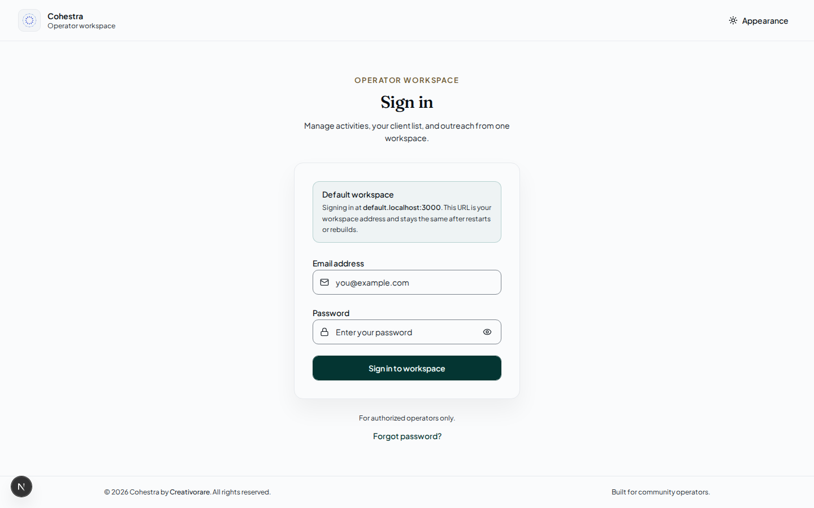
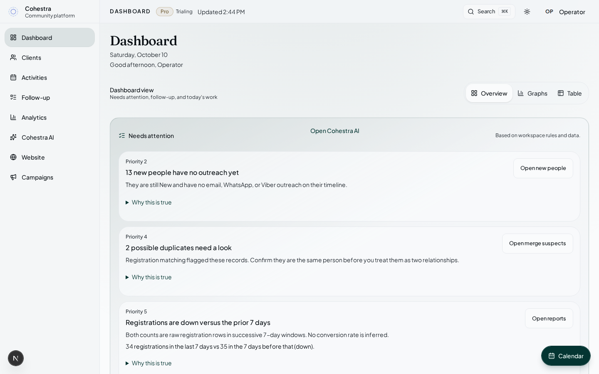
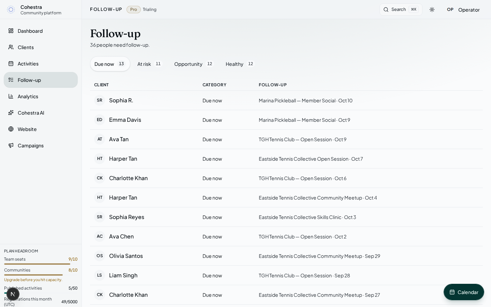
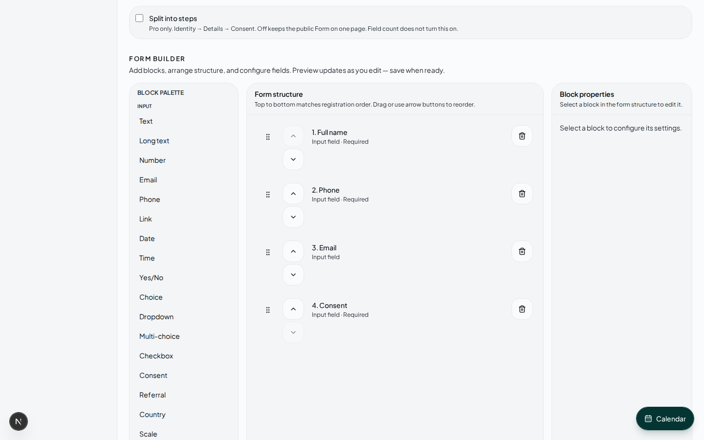
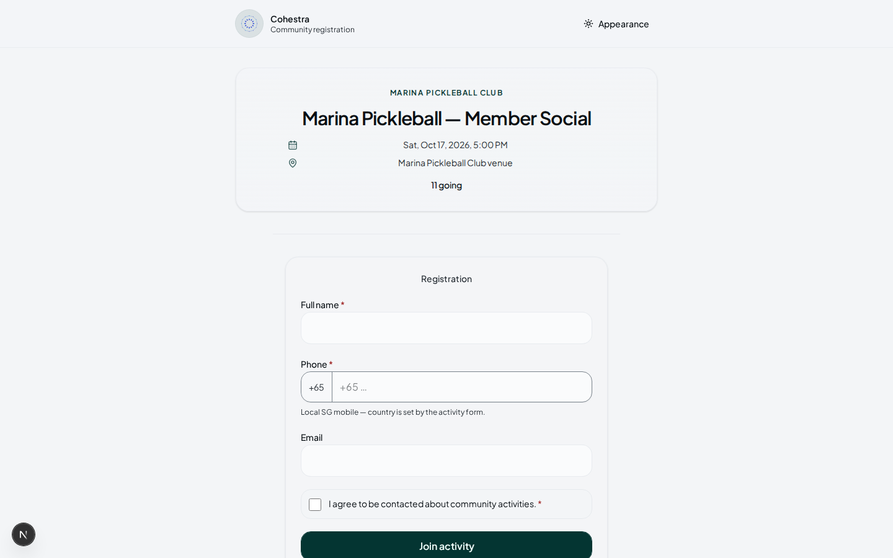

# Cohestra — Operator User Manual

**Product:** Cohestra by Creativorare  
**Audience:** Workspace admins and members  
**Version:** 2.0  
**Last updated:** 10 October 2026  
**Canonical web guide:** `/docs` (`web/lib/marketing/product-docs-content.ts`)

This Markdown file must stay aligned with the public Document. Screenshots: `web/public/docs-screenshots/`.

It does not cover servers, installation, or internal administration consoles.

---

## Chapters

1. What Cohestra is
2. Who uses Cohestra
3. Sign up, sign in, and recovery
4. First ten minutes
5. Workspace navigation
6. Dashboard
7. Communities and categories
8. Create an activity
9. Form Studio — Build form
10. Form Studio — Design and Preview
11. Publish, QR, and links
12. Public registration
13. Clients
14. Follow-up
15. Website Studio
16. Email campaigns
17. Analytics
18. Cohestra AI
19. Settings, Team, and Billing
20. Plans
21. Troubleshooting
22. Glossary

Deep links on the web guide keep the previous `/docs#…` ids (`#reports` still opens Analytics).

---

## Facts that must stay true

- Guests never sign in. They use `/register/{slug}` or a QR from Share kit.
- Form Preview simulates a submit and never creates a public registration.
- Follow-up is `/follow-up` with Due now, At risk, Opportunity, Healthy.
- Analytics is `/analytics`. `/reports` is a compatibility address.
- Cohestra AI is `/ai` (also `/intelligence`, `/needs-attention`). It is a brief with recommended actions, not a chatbot.
- Website Studio is `/dashboard/website` and needs Core+.
- Campaigns needs Pro and consented recipients only.
- Team is admin-only and Core+. Billing is for Basic admins or the billing owner.
- Plan caps (Basic / Core / Pro): seats 1 / 3 / 10; communities 1 / 3 / 10; published activities 4 / 12 / 50; registrations per month 250 / 500 / 5,000.
- Form recipes, two-column layouts, and domain blocks need Core+. Saved templates: Basic 1 / Core 5 / Pro 25. Split into steps needs Pro.
- Analytics weekly + CSV is on every plan. Monthly queryable reports unlock on Core+.

See `/docs` for numbered UI steps and the genuine screenshots.

